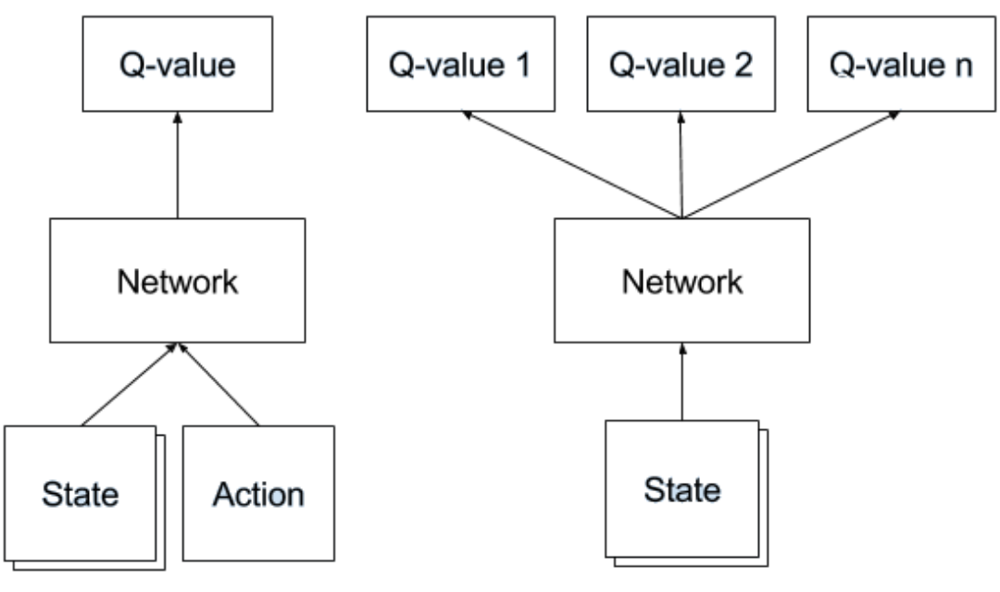
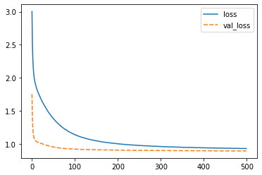
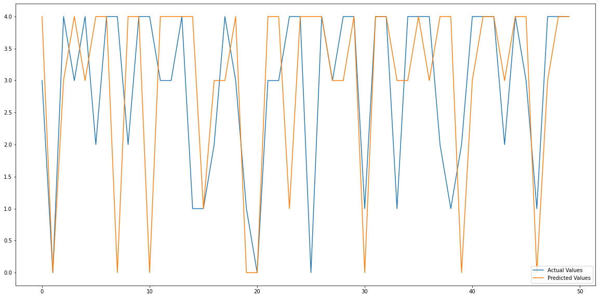

# Predicting Flights Taxi-Out Time Using Deep Q-Learning
Data used in this project can be downloaded from https://www.transtats.bts.gov/Fields.asp. This project is inspired by this paper https://ieeexplore.ieee.org/document/7411275.

#### We will use the data from April 2019 in this code
Several challenges presented themselves when working with this data and trying to adapt the papers' approach namely:
- the extreme difficulty of calculating next states something which was not outlined in the paper at all. for this reason the reward function was modified to take into account the reward from the reward table and the penalty of wrong prediction instead of the maximum future rewarss
- Facing new states that have not been faced before. In the paper the author relied on matlabs functionality to handle this and did not discuss at at all. My approach is to build a neural network to predict the Q values for a state if it had not been faced before and then pass those Q values to the RL model.




```python
import pandas as pd
from IPython.display import HTML
from datetime import datetime, date, time, timedelta
import warnings
warnings.filterwarnings("ignore")

df = pd.read_csv('data.csv').drop('Unnamed: 24', axis=1)
df = df[(df.CANCELLED == 0) & (df.DIVERTED == 0)].drop(
    ['CANCELLED', 'DIVERTED'], axis=1)
```

# Data Processing - creating the environment
X1 is going to be Taxi Out time, our target


```python
df['x1'] = df['TAXI_OUT']
```

## Windowing
To be able to achieve the windowing described in the paper we will need to convert DEP_TIME and ARR_TIME into a python datetime object. We will also use the date from FL_DATE


```python
def time_converter(in_):
    in_date = in_[0]
    in_time = in_[1]
    in_time = str(in_time)
    if '.' in in_time:
        in_time = in_time[:-2]
    while len(str(in_time)) < 4:
        in_time = '0' + in_time
    if in_time[:2] == '24':
        in_time = '00' + in_time[2:]
    time_ = time(int(in_time[:2]), int(in_time[2:4]), 0)
    in_date = in_date.split('-')
    date_ = date(int(in_date[0]), int(in_date[1]), int(in_date[2]))
    return datetime.combine(date_, time_)


time_cols = ['CRS_DEP_TIME', 'DEP_TIME', 'WHEELS_OFF',
             'WHEELS_ON', 'CRS_ARR_TIME', 'ARR_TIME', ]

for i, col in enumerate(time_cols):
    df[col] = df[['FL_DATE', col]].apply(time_converter, axis=1)
    print(f"{round(100*(i+1)/len(time_cols),2)}% done.")
```

    16.67% done.
    33.33% done.
    50.0% done.
    66.67% done.
    83.33% done.
    100.0% done.


The function get_bounds will calculate the bounds of each window, +-20 minutes from the flight being considered.
after that airplane_counter function was created to calculate the number of departure aircrafts sharing the runway with the aircraft being considered (x2). a few helper functions are created to track the progress of the function because it's a very lengthy calculation.


```python
def get_bounds(in_time):
    time_d = timedelta(minutes=20)
    return (in_time - time_d),  (in_time + time_d)


def window_func(TIME, variable, df):
    lower_bound, upper_bound = get_bounds(TIME)
    df_ = df[(df[variable] >= lower_bound) & (df[variable] <=
                                              upper_bound)].copy()
    count_airplanes = len(df_) - 1
    return count_airplanes


def pct_tracker(to_be_done):
    done = 0
    count = 0
    while True:
        yield
        done += 1
        count += 1
        if done > to_be_done:
            done -= to_be_done
        if (count >= to_be_done * 0.02):
            count = 0
            pct = round((float(done) / float(to_be_done)) * 100, 2)
            print(f"{pct}% done.")


def track_progress(func=window_func, progress=pct_tracker(len(df))):
    def call_func(*args, **kwargs):
        progress.send(None)
        return func(*args, **kwargs)
    return call_func


def airplane_counter(func, variable, airport_type, list, add_cols=[]):
    listy = []
    sub_df = df.sort_values(by=[airport_type, variable])[
        [airport_type, variable] + add_cols].copy()
    for i, airport in enumerate(list):
        x = sub_df[sub_df[airport_type] == airport].copy()
        x['target'] = x[variable].apply(
            track_progress(func), args=([variable, x]))
        listy.append(x)
    series = pd.concat(listy).sort_values(by=[airport_type, variable]).target
    return series


df = df.sort_values(by=['ORIGIN', 'DEP_TIME']).copy()
origins = df.ORIGIN.unique().tolist()

x2 = airplane_counter(window_func, 'DEP_TIME', 'ORIGIN', origins)
```

    2.0% done.
    4.0% done.
    6.0% done.
    8.0% done.
    10.0% done.
    12.0% done.
    14.0% done.
    16.0% done.
    18.0% done.
    20.0% done.
    22.0% done.
    24.0% done.
    26.0% done.
    28.0% done.
    30.0% done.
    32.0% done.
    34.0% done.
    36.0% done.
    38.0% done.
    40.0% done.
    42.0% done.
    44.0% done.
    46.0% done.
    48.0% done.
    50.0% done.
    52.0% done.
    54.0% done.
    56.0% done.
    58.0% done.
    60.0% done.
    62.0% done.
    64.0% done.
    66.0% done.
    68.0% done.
    70.0% done.
    72.0% done.
    74.0% done.
    76.0% done.
    78.0% done.
    80.0% done.
    82.0% done.
    84.0% done.
    86.0% done.
    88.0% done.
    90.0% done.
    92.0% done.
    94.0% done.
    96.0% done.
    98.0% done.


Similarly, we will calculate the number of arrival aircrafts sharing the runway with the aircraft being considered in the +-20 minutes window (x3)


```python
df['x2'] = x2

df = df.sort_values(by=['DEST', 'ARR_TIME']).copy()
destinations = df.DEST.unique().tolist()

sub_df = df.sort_values(by=['DEST', 'ARR_TIME'])[
    ['DEST', 'ARR_TIME', 'ARR_DELAY']].copy()
dict_ = {dest: sub_df[sub_df['DEST'] == dest].copy() for dest in destinations}


def window_func_arr(in_):
    ORIGIN, TIME = in_[0], in_[1]
    lower_bound, upper_bound = get_bounds(TIME)
    df = dict_[ORIGIN]
    df_ = df[(df['ARR_TIME'] >= lower_bound) & (df['ARR_TIME'] <=
                                                upper_bound)].copy()
    count_airplanes = len(df_)
    return count_airplanes


df['x3'] = df[['ORIGIN', 'DEP_TIME']].apply(
    track_progress(window_func_arr), axis=1)
```

    0.01% done.
    2.01% done.
    4.01% done.
    6.01% done.
    8.01% done.
    10.01% done.
    12.01% done.
    14.01% done.
    16.01% done.
    18.01% done.
    20.01% done.
    22.01% done.
    24.01% done.
    26.01% done.
    28.01% done.
    30.01% done.
    32.01% done.
    34.01% done.
    36.01% done.
    38.01% done.
    40.01% done.
    42.01% done.
    44.01% done.
    46.01% done.
    48.01% done.
    50.01% done.
    52.01% done.
    54.01% done.
    56.01% done.
    58.01% done.
    60.01% done.
    62.01% done.
    64.01% done.
    66.01% done.
    68.01% done.
    70.01% done.
    72.01% done.
    74.01% done.
    76.01% done.
    78.01% done.
    80.01% done.
    82.01% done.
    84.01% done.
    86.01% done.
    88.01% done.
    90.01% done.
    92.01% done.
    94.01% done.
    96.01% done.
    98.01% done.


-we will calculate the average taxi out time for each airoprt (x4)

-We will also define a function to check if the flight is or is not during peak time (x5)

-we will take (x6) to be air time and we will take (x7) to be taxi in


```python
def is_peak(dep_time):
    dep_time = dep_time.time()
    if (dep_time >= time(4, 0) and (dep_time <= time(16, 0))):
        return 1
    else:
        return 2


dict_averages={origin: df[df.ORIGIN == origin]
                 ['TAXI_OUT'].mean() for origin in origins}


def avg_taxi_out(origin, dict=dict_averages):
    return dict[origin]


df['x4']=df.ORIGIN.apply(avg_taxi_out)

df['x5']=df.DEP_TIME.apply(is_peak)

df['x6']=df.AIR_TIME

df['x7']=df.TAXI_IN

df.to_csv('snapshot.csv', index=False)
```

-we will define x* as the number of late aircrafts sharing the runway with the aircraft being considered in the time window


```python
def late_to_leave(TIME, variable, df):
    lower_bound, upper_bound=get_bounds(TIME)
    df_=df[(df[variable] >= lower_bound) & (df[variable] <=
                                              upper_bound) & ((df['DEP_DELAY'] < -15) | (df['DEP_DELAY'] > 15))].copy()
    count_airplanes=len(df_)
    return count_airplanes

x8=airplane_counter(late_to_leave, 'DEP_TIME', 'ORIGIN',
                    origins, add_cols=['DEP_DELAY'])

df['x8']=x8
```

    0.01% done.
    2.01% done.
    4.01% done.
    6.01% done.
    8.01% done.
    10.01% done.
    12.01% done.
    14.01% done.
    16.01% done.
    18.01% done.
    20.01% done.
    22.01% done.
    24.01% done.
    26.01% done.
    28.01% done.
    30.01% done.
    32.01% done.
    34.01% done.
    36.01% done.
    38.01% done.
    40.01% done.
    42.01% done.
    44.01% done.
    46.01% done.
    48.01% done.
    50.01% done.
    52.01% done.
    54.01% done.
    56.01% done.
    58.01% done.
    60.01% done.
    62.01% done.
    64.01% done.
    66.01% done.
    68.01% done.
    70.01% done.
    72.01% done.
    74.01% done.
    76.01% done.
    78.01% done.
    80.01% done.
    82.01% done.
    84.01% done.
    86.01% done.
    88.01% done.
    90.01% done.
    92.01% done.
    94.01% done.
    96.02% done.
    98.02% done.


x9 is the number of late arriving aircrafts on the runway in the time window


```python
def late_to_arrive(in_):
    ORIGIN, TIME=in_[0], in_[1]
    lower_bound, upper_bound=get_bounds(TIME)
    df=dict_[ORIGIN]
    df_=df[(df['ARR_TIME'] >= lower_bound) & (df['ARR_TIME'] <=
                                                upper_bound) & ((df['ARR_DELAY'] < -15) | (df['ARR_DELAY'] > 15))].copy()
    count_airplanes=len(df_)
    return count_airplanes

df['x9']=df[['ORIGIN', 'DEP_TIME']].apply(
    track_progress(late_to_arrive), axis=1)

df[['ORIGIN', 'DEP_TIME'] +
    ['x' + str(i) for i in range(1, 10)]].to_csv('variables.csv', index=False)

work_df=df[['ORIGIN', 'DEP_TIME'] +
    ['x' + str(i) for i in range(1, 10)]]
```

    0.02% done.
    2.02% done.
    4.02% done.
    6.02% done.
    8.02% done.
    10.02% done.
    12.02% done.
    14.02% done.
    16.02% done.
    18.02% done.
    20.02% done.
    22.02% done.
    24.02% done.
    26.02% done.
    28.02% done.
    30.02% done.
    32.02% done.
    34.02% done.
    36.02% done.
    38.02% done.
    40.02% done.
    42.02% done.
    44.02% done.
    46.02% done.
    48.02% done.
    50.02% done.
    52.02% done.
    54.02% done.
    56.02% done.
    58.02% done.
    60.02% done.
    62.02% done.
    64.02% done.
    66.02% done.
    68.02% done.
    70.02% done.
    72.02% done.
    74.02% done.
    76.02% done.
    78.02% done.
    80.02% done.
    82.02% done.
    84.02% done.
    86.02% done.
    88.02% done.
    90.02% done.
    92.02% done.
    94.02% done.
    96.02% done.
    98.02% done.


Finally we will discretize our environment variables and with that our environment will be complete. our target x1 is going to be descritized into 5 bins


```python
work_df=pd.read_csv('variables.csv')
work_df['DEP_TIME']=pd.to_datetime(work_df['DEP_TIME'])
print('non discretized environment variables')
work_df.iloc[:10,:]
```

    non discretized environment variables


<div>
<style scoped>
    .dataframe tbody tr th:only-of-type {
        vertical-align: middle;
    }

    .dataframe tbody tr th {
        vertical-align: top;
    }

    .dataframe thead th {
        text-align: right;
    }
</style>
<table border="1" class="dataframe">
  <thead>
    <tr style="text-align: right;">
      <th></th>
      <th>ORIGIN</th>
      <th>DEP_TIME</th>
      <th>x1</th>
      <th>x2</th>
      <th>x3</th>
      <th>x4</th>
      <th>x5</th>
      <th>x6</th>
      <th>x7</th>
      <th>x8</th>
      <th>x9</th>
    </tr>
  </thead>
  <tbody>
    <tr>
      <th>0</th>
      <td>SFB</td>
      <td>2019-04-01 06:58:00</td>
      <td>15.0</td>
      <td>7</td>
      <td>0</td>
      <td>13.801970</td>
      <td>1</td>
      <td>127.0</td>
      <td>4.0</td>
      <td>6</td>
      <td>0</td>
    </tr>
    <tr>
      <th>1</th>
      <td>CLT</td>
      <td>2019-04-01 09:46:00</td>
      <td>27.0</td>
      <td>33</td>
      <td>28</td>
      <td>21.445305</td>
      <td>1</td>
      <td>68.0</td>
      <td>5.0</td>
      <td>9</td>
      <td>21</td>
    </tr>
    <tr>
      <th>2</th>
      <td>DTW</td>
      <td>2019-04-01 10:09:00</td>
      <td>18.0</td>
      <td>39</td>
      <td>16</td>
      <td>17.244655</td>
      <td>1</td>
      <td>62.0</td>
      <td>4.0</td>
      <td>13</td>
      <td>15</td>
    </tr>
    <tr>
      <th>3</th>
      <td>ATL</td>
      <td>2019-04-01 10:39:00</td>
      <td>11.0</td>
      <td>58</td>
      <td>42</td>
      <td>15.761485</td>
      <td>1</td>
      <td>95.0</td>
      <td>3.0</td>
      <td>18</td>
      <td>22</td>
    </tr>
    <tr>
      <th>4</th>
      <td>PHL</td>
      <td>2019-04-01 12:47:00</td>
      <td>14.0</td>
      <td>22</td>
      <td>9</td>
      <td>21.666012</td>
      <td>1</td>
      <td>15.0</td>
      <td>4.0</td>
      <td>3</td>
      <td>4</td>
    </tr>
    <tr>
      <th>5</th>
      <td>SFB</td>
      <td>2019-04-01 12:13:00</td>
      <td>13.0</td>
      <td>1</td>
      <td>3</td>
      <td>13.801970</td>
      <td>1</td>
      <td>120.0</td>
      <td>4.0</td>
      <td>1</td>
      <td>1</td>
    </tr>
    <tr>
      <th>6</th>
      <td>ORD</td>
      <td>2019-04-01 13:56:00</td>
      <td>33.0</td>
      <td>65</td>
      <td>44</td>
      <td>21.773309</td>
      <td>1</td>
      <td>84.0</td>
      <td>5.0</td>
      <td>20</td>
      <td>20</td>
    </tr>
    <tr>
      <th>7</th>
      <td>DTW</td>
      <td>2019-04-01 15:40:00</td>
      <td>21.0</td>
      <td>42</td>
      <td>22</td>
      <td>17.244655</td>
      <td>1</td>
      <td>61.0</td>
      <td>3.0</td>
      <td>9</td>
      <td>13</td>
    </tr>
    <tr>
      <th>8</th>
      <td>ATL</td>
      <td>2019-04-01 15:49:00</td>
      <td>15.0</td>
      <td>37</td>
      <td>53</td>
      <td>15.761485</td>
      <td>1</td>
      <td>100.0</td>
      <td>4.0</td>
      <td>10</td>
      <td>12</td>
    </tr>
    <tr>
      <th>9</th>
      <td>CLT</td>
      <td>2019-04-01 16:24:00</td>
      <td>19.0</td>
      <td>52</td>
      <td>19</td>
      <td>21.445305</td>
      <td>2</td>
      <td>74.0</td>
      <td>6.0</td>
      <td>7</td>
      <td>10</td>
    </tr>
  </tbody>
</table>
</div>


```python
from sklearn.preprocessing import KBinsDiscretizer

discretizer=KBinsDiscretizer(n_bins=5, encode='ordinal')
work_df['x1']=discretizer.fit_transform(
    work_df['x1'].to_numpy().reshape(-1, 1))

discretizer2=KBinsDiscretizer(n_bins=10, encode='ordinal')

for i in range(2, 10):
    work_df['x' + str(i)]=discretizer2.fit_transform(
        work_df['x' + str(i)].to_numpy().reshape(-1, 1))
print('Discretized env variables')
work_df.iloc[:10,:]
```

    Discretized env variables


<div>
<style scoped>
    .dataframe tbody tr th:only-of-type {
        vertical-align: middle;
    }

    .dataframe tbody tr th {
        vertical-align: top;
    }

    .dataframe thead th {
        text-align: right;
    }
</style>
<table border="1" class="dataframe">
  <thead>
    <tr style="text-align: right;">
      <th></th>
      <th>ORIGIN</th>
      <th>DEP_TIME</th>
      <th>x1</th>
      <th>x2</th>
      <th>x3</th>
      <th>x4</th>
      <th>x5</th>
      <th>x6</th>
      <th>x7</th>
      <th>x8</th>
      <th>x9</th>
    </tr>
  </thead>
  <tbody>
    <tr>
      <th>0</th>
      <td>SFB</td>
      <td>2019-04-01 06:58:00</td>
      <td>2.0</td>
      <td>3.0</td>
      <td>0.0</td>
      <td>2.0</td>
      <td>0.0</td>
      <td>7.0</td>
      <td>2.0</td>
      <td>4.0</td>
      <td>0.0</td>
    </tr>
    <tr>
      <th>1</th>
      <td>CLT</td>
      <td>2019-04-01 09:46:00</td>
      <td>4.0</td>
      <td>8.0</td>
      <td>7.0</td>
      <td>8.0</td>
      <td>0.0</td>
      <td>3.0</td>
      <td>3.0</td>
      <td>5.0</td>
      <td>7.0</td>
    </tr>
    <tr>
      <th>2</th>
      <td>DTW</td>
      <td>2019-04-01 10:09:00</td>
      <td>3.0</td>
      <td>8.0</td>
      <td>5.0</td>
      <td>6.0</td>
      <td>0.0</td>
      <td>2.0</td>
      <td>2.0</td>
      <td>5.0</td>
      <td>6.0</td>
    </tr>
    <tr>
      <th>3</th>
      <td>ATL</td>
      <td>2019-04-01 10:39:00</td>
      <td>1.0</td>
      <td>9.0</td>
      <td>8.0</td>
      <td>4.0</td>
      <td>0.0</td>
      <td>5.0</td>
      <td>1.0</td>
      <td>5.0</td>
      <td>7.0</td>
    </tr>
    <tr>
      <th>4</th>
      <td>PHL</td>
      <td>2019-04-01 12:47:00</td>
      <td>2.0</td>
      <td>7.0</td>
      <td>4.0</td>
      <td>8.0</td>
      <td>0.0</td>
      <td>0.0</td>
      <td>2.0</td>
      <td>3.0</td>
      <td>3.0</td>
    </tr>
    <tr>
      <th>5</th>
      <td>SFB</td>
      <td>2019-04-01 12:13:00</td>
      <td>2.0</td>
      <td>1.0</td>
      <td>1.0</td>
      <td>2.0</td>
      <td>0.0</td>
      <td>6.0</td>
      <td>2.0</td>
      <td>1.0</td>
      <td>1.0</td>
    </tr>
    <tr>
      <th>6</th>
      <td>ORD</td>
      <td>2019-04-01 13:56:00</td>
      <td>4.0</td>
      <td>9.0</td>
      <td>8.0</td>
      <td>9.0</td>
      <td>0.0</td>
      <td>4.0</td>
      <td>3.0</td>
      <td>5.0</td>
      <td>7.0</td>
    </tr>
    <tr>
      <th>7</th>
      <td>DTW</td>
      <td>2019-04-01 15:40:00</td>
      <td>4.0</td>
      <td>8.0</td>
      <td>7.0</td>
      <td>6.0</td>
      <td>0.0</td>
      <td>2.0</td>
      <td>1.0</td>
      <td>5.0</td>
      <td>6.0</td>
    </tr>
    <tr>
      <th>8</th>
      <td>ATL</td>
      <td>2019-04-01 15:49:00</td>
      <td>2.0</td>
      <td>8.0</td>
      <td>8.0</td>
      <td>4.0</td>
      <td>0.0</td>
      <td>5.0</td>
      <td>2.0</td>
      <td>5.0</td>
      <td>6.0</td>
    </tr>
    <tr>
      <th>9</th>
      <td>CLT</td>
      <td>2019-04-01 16:24:00</td>
      <td>3.0</td>
      <td>9.0</td>
      <td>6.0</td>
      <td>8.0</td>
      <td>0.0</td>
      <td>3.0</td>
      <td>4.0</td>
      <td>5.0</td>
      <td>5.0</td>
    </tr>
  </tbody>
</table>
</div>


### Making the train and validation datasets
we will take the first three weeks of april as the training dataset and the last week as the validation dataset


```python
train_df=work_df[work_df.DEP_TIME < datetime.combine(
    date(2019, 4, 24), time(0, 0, 0))]

validation_df=work_df[work_df.DEP_TIME >=
    datetime.combine(date(2019, 4, 24), time(0, 0, 0))]

train_env=train_df[['x' + str(i) for i in range(1, 10)]
                              ].to_numpy()

validation_env=validation_df[['x' + str(i) for i in range(1, 10)]
                              ].to_numpy()
```

### Making the rewards table (P)
the rewards table is going to be made so that it will have the value of three for the correct action and zero for all other actions

### Encoding states
each state vector will be encoded to byte code to help us look it up in later steps.

All of the status will be stored in a list named real_states

Finally we will initialize the Q table


```python
import numpy as np
np.frombuffer(train_env[0].tobytes())
states_available=list(set([(i.tobytes(), i[0]) for i in train_env]))

from random import randrange, uniform

def reward_initializer(label):
    label=int(label)
    listy=[0 for i in range(5)]
    reward=3
    listy[label]=reward
    label_=label
    while True:
        try:
            label_ += 1
            listy[label_]=uniform(0, 1)
        except IndexError:
            break
    label_=label
    reward=3
    while True:
        try:
            label_ -= 1
            if label_ < 0:
                break
            listy[label_]=uniform(0, 1)
        except IndexError:
            break
    return listy

P={s[0]: reward_initializer(s[1]) for s in states_available}
import numpy as np
q_table={s[0]: np.asarray([0, 0, 0, 0, 0]) for s in states_available}
states=list(P.keys())
real_states=[np.frombuffer(i) for i in states]
```

To fill the Q table we are going to use the following values for alpha, gamma and epsilon. wwe're going to iterate 25 times over each state to populate its corresponding Q table record


```python
print('Sample of P')
{key:value for key,value in list(P.items())[0:5]}
```

    Sample of P


    {b'\x00\x00\x00\x00\x00\x00\x10@\x00\x00\x00\x00\x00\x00\x14@\x00\x00\x00\x00\x00\x00\x10@\x00\x00\x00\x00\x00\x00"@\x00\x00\x00\x00\x00\x00\x00\x00\x00\x00\x00\x00\x00\x00\x08@\x00\x00\x00\x00\x00\x00\x18@\x00\x00\x00\x00\x00\x00\x08@\x00\x00\x00\x00\x00\x00\x10@': [0.6706975067655605,
      0.9192702944641356,
      0.08005256218749413,
      0.7944636545570759,
      3],
     b'\x00\x00\x00\x00\x00\x00\x10@\x00\x00\x00\x00\x00\x00 @\x00\x00\x00\x00\x00\x00\x1c@\x00\x00\x00\x00\x00\x00 @\x00\x00\x00\x00\x00\x00\x00\x00\x00\x00\x00\x00\x00\x00\x08@\x00\x00\x00\x00\x00\x00\x18@\x00\x00\x00\x00\x00\x00\x10@\x00\x00\x00\x00\x00\x00\x18@': [0.030056077440060225,
      0.2478930912198971,
      0.44397333582370924,
      0.02285937405431515,
      3],
     b'\x00\x00\x00\x00\x00\x00\x00@\x00\x00\x00\x00\x00\x00\x10@\x00\x00\x00\x00\x00\x00\x00@\x00\x00\x00\x00\x00\x00\x00@\x00\x00\x00\x00\x00\x00\x00\x00\x00\x00\x00\x00\x00\x00\x1c@\x00\x00\x00\x00\x00\x00 @\x00\x00\x00\x00\x00\x00\x14@\x00\x00\x00\x00\x00\x00\x00@': [0.348017467233081,
      0.15099087090506957,
      3,
      0.13424803922918938,
      0.199585426973092],
     b'\x00\x00\x00\x00\x00\x00\x00\x00\x00\x00\x00\x00\x00\x00\x10@\x00\x00\x00\x00\x00\x00\x08@\x00\x00\x00\x00\x00\x00\x00\x00\x00\x00\x00\x00\x00\x00\x00\x00\x00\x00\x00\x00\x00\x00\x10@\x00\x00\x00\x00\x00\x00\x08@\x00\x00\x00\x00\x00\x00\x08@\x00\x00\x00\x00\x00\x00\x00@': [3,
      0.1464727704962423,
      0.3127832057773594,
      0.09945829572459819,
      0.18992221066129444],
     b'\x00\x00\x00\x00\x00\x00\x00\x00\x00\x00\x00\x00\x00\x00\x1c@\x00\x00\x00\x00\x00\x00\x18@\x00\x00\x00\x00\x00\x00\x14@\x00\x00\x00\x00\x00\x00\x00\x00\x00\x00\x00\x00\x00\x00\x00@\x00\x00\x00\x00\x00\x00\x14@\x00\x00\x00\x00\x00\x00\x08@\x00\x00\x00\x00\x00\x00\x18@': [3,
      0.5031640708097382,
      0.6906652972889104,
      0.40436181108633995,
      0.3125233852293364]}


```python
alpha=0.4
gamma=0.6
epsilon=0.65

for i, state in enumerate(train_env):
    q=[0, 0, 0, 0, 0]
    for _ in range(25):
        state_encoded=state.tobytes()
        if uniform(0, 1) < epsilon:
            action=randrange(5)
        else:
            action=np.argmax(q_table[state_encoded])
        reward=P[state_encoded][action]
        old_value=q_table[state_encoded][action]
        new_value=(1 - alpha) * old_value + alpha *\
                   (reward - gamma * (action - state[0])**2)
        q[action]=new_value
    q_table[state_encoded]=q
    if i % 9949 == 0:
        print(f"{round((i+1)*100/len(train_env),2)}%")
```

    0.0%
    1.99%
    3.99%
    5.98%
    7.97%
    9.97%
    11.96%
    13.95%
    15.95%
    17.94%
    19.93%
    21.92%
    23.92%
    25.91%
    27.9%
    29.9%
    31.89%
    33.88%
    35.88%
    37.87%
    39.86%
    41.86%
    43.85%
    45.84%
    47.84%
    49.83%
    51.82%
    53.82%
    55.81%
    57.8%
    59.79%
    61.79%
    63.78%
    65.77%
    67.77%
    69.76%
    71.75%
    73.75%
    75.74%
    77.73%
    79.73%
    81.72%
    83.71%
    85.71%
    87.7%
    89.69%
    91.69%
    93.68%
    95.67%
    97.66%
    99.66%


```python
print("sample of q_table")
{key:value for key,value in list(q_table.items())[0:5]}
```

    sample of q_table


    {b'\x00\x00\x00\x00\x00\x00\x10@\x00\x00\x00\x00\x00\x00\x14@\x00\x00\x00\x00\x00\x00\x10@\x00\x00\x00\x00\x00\x00"@\x00\x00\x00\x00\x00\x00\x00\x00\x00\x00\x00\x00\x00\x00\x08@\x00\x00\x00\x00\x00\x00\x18@\x00\x00\x00\x00\x00\x00\x08@\x00\x00\x00\x00\x00\x00\x10@': [-3.571720997293776,
      -1.7922918822143457,
      -0.9279789751250024,
      0.07778546182283037,
      1.2000000000000002],
     b'\x00\x00\x00\x00\x00\x00\x10@\x00\x00\x00\x00\x00\x00 @\x00\x00\x00\x00\x00\x00\x1c@\x00\x00\x00\x00\x00\x00 @\x00\x00\x00\x00\x00\x00\x00\x00\x00\x00\x00\x00\x00\x00\x08@\x00\x00\x00\x00\x00\x00\x18@\x00\x00\x00\x00\x00\x00\x10@\x00\x00\x00\x00\x00\x00\x18@': [-6.124764110438361,
      -3.297348421619266,
      -1.251857065072826,
      -0.3693700006052383,
      1.9200000000000004],
     b'\x00\x00\x00\x00\x00\x00\x00@\x00\x00\x00\x00\x00\x00\x10@\x00\x00\x00\x00\x00\x00\x00@\x00\x00\x00\x00\x00\x00\x00@\x00\x00\x00\x00\x00\x00\x00\x00\x00\x00\x00\x00\x00\x00\x1c@\x00\x00\x00\x00\x00\x00 @\x00\x00\x00\x00\x00\x00\x14@\x00\x00\x00\x00\x00\x00\x00@': [-0.8207930131067676,
      -0.17960365163797218,
      0,
      -0.18630078430832425,
      -0.8801658292107633],
     b'\x00\x00\x00\x00\x00\x00\x00\x00\x00\x00\x00\x00\x00\x00\x10@\x00\x00\x00\x00\x00\x00\x08@\x00\x00\x00\x00\x00\x00\x00\x00\x00\x00\x00\x00\x00\x00\x00\x00\x00\x00\x00\x00\x00\x00\x10@\x00\x00\x00\x00\x00\x00\x08@\x00\x00\x00\x00\x00\x00\x08@\x00\x00\x00\x00\x00\x00\x00@': [2.7667200000000003,
      -0.41826095213754544,
      -1.924914816303888,
      -4.888371581350947,
      -8.67835014043973],
     b'\x00\x00\x00\x00\x00\x00\x00\x00\x00\x00\x00\x00\x00\x00\x1c@\x00\x00\x00\x00\x00\x00\x18@\x00\x00\x00\x00\x00\x00\x14@\x00\x00\x00\x00\x00\x00\x00\x00\x00\x00\x00\x00\x00\x00\x00@\x00\x00\x00\x00\x00\x00\x14@\x00\x00\x00\x00\x00\x00\x08@\x00\x00\x00\x00\x00\x00\x18@': [1.9200000000000004,
      -0.06197499468176751,
      -1.0939742097350973,
      -3.197208440904742,
      -5.943985033453224]}


We will then take x2 to x9 and scale them for use in our neural network and we are going to separate x1, which is the target. We will also scale q_table


```python
from sklearn.preprocessing import StandardScaler
scaler=StandardScaler().fit(
    np.vstack([train_env[:, 1:], validation_env[:, 1:]]))
train_X=scaler.transform(np.asarray(real_states)[:, 1:])
validation_X=scaler.transform(validation_env[:, 1:])
train_y=train_env[:, 0]
validation_y=validation_env[:, 0]

np_q_table=np.array(list(q_table.values()))
np_q_table=StandardScaler().fit_transform(np_q_table)
```

### The neural network
Next we will build a neural network that was described in this book (Geron A. Hands-on Machine Learning with...2ed 2019) this network is very robust in mutiple regression problems.


```python
import tensorflow as tf
gpus=tf.config.experimental.list_physical_devices('GPU')
tf.config.experimental.set_memory_growth(gpus[0], True)
from tensorflow import keras

def builder(neurons=40, dropout_rate=.6, n_layer=2, momentum=.8, learn_rate=1e-4):
    input_l=keras.layers.Input(shape=(8,))
    drop1=keras.layers.Dropout(rate=dropout_rate)(input_l)
    hidden_layers=[drop1]
    n=0
    for i in range(n_layer):
        hidden_layers.append(keras.layers.Dense(
            neurons, activation='selu', kernel_initializer='lecun_normal')(hidden_layers[n]))
        n_neurons=int(np.ceil(neurons / 2))
        n += 1
        hidden_layers.append(keras.layers.Dropout(
            rate=dropout_rate)(hidden_layers[n]))
        n += 1
    concat=keras.layers.Concatenate()([hidden_layers[n - 1], input_l])
    output=keras.layers.Dense(5, activation='selu')(concat)
    model=keras.Model(inputs=[input_l], outputs=[output])
    model.compile(loss="mse", optimizer=keras.optimizers.SGD(
        lr=learn_rate, momentum=momentum, nesterov=True))
    return model
```

We will then use RandomizedSearchCV to find the optimal parameter for this model


```python
from sklearn.model_selection import RandomizedSearchCV

neurons=[40, 80, 160]
learn_rate=[1e-3, 1e-4]
momentum=[.6, .8]
dropout_rate=[.2, .4, .6]
n_layer=[2, 3, 4]
param_grid=dict(neurons=neurons, learn_rate=learn_rate,
                momentum=momentum, dropout_rate=dropout_rate, n_layer=n_layer)

model_to_optimize=keras.wrappers.scikit_learn.KerasRegressor(
    build_fn=builder, verbose=0)

rnd_search_cv=RandomizedSearchCV(
    estimator=model_to_optimize, param_distributions=param_grid, n_iter=25, cv=3, verbose=10)

rnd_search_cv.fit(train_X, np_q_table, epochs=50, batch_size=512,
                  validation_split=.2, callbacks=[early_stop_CB])

print(rnd_search_cv.best_params_)

cv_results_df=pd.DataFrame(rnd_search_cv.cv_results_)
cv_results_df
```

    Fitting 3 folds for each of 25 candidates, totalling 75 fits
    [CV] neurons=160, n_layer=2, momentum=0.6, learn_rate=0.001, dropout_rate=0.2 


    [Parallel(n_jobs=1)]: Using backend SequentialBackend with 1 concurrent workers.


    [CV]  neurons=160, n_layer=2, momentum=0.6, learn_rate=0.001, dropout_rate=0.2, score=-0.883, total=  17.9s
    [CV] neurons=160, n_layer=2, momentum=0.6, learn_rate=0.001, dropout_rate=0.2 


    [Parallel(n_jobs=1)]: Done   1 out of   1 | elapsed:   17.9s remaining:    0.0s


    [CV]  neurons=160, n_layer=2, momentum=0.6, learn_rate=0.001, dropout_rate=0.2, score=-0.883, total=  18.3s
    [CV] neurons=160, n_layer=2, momentum=0.6, learn_rate=0.001, dropout_rate=0.2 


    [Parallel(n_jobs=1)]: Done   2 out of   2 | elapsed:   36.1s remaining:    0.0s


    [CV]  neurons=160, n_layer=2, momentum=0.6, learn_rate=0.001, dropout_rate=0.2, score=-0.883, total=  18.6s
    [CV] neurons=40, n_layer=2, momentum=0.6, learn_rate=0.001, dropout_rate=0.6 


    [Parallel(n_jobs=1)]: Done   3 out of   3 | elapsed:   54.8s remaining:    0.0s


    [CV]  neurons=40, n_layer=2, momentum=0.6, learn_rate=0.001, dropout_rate=0.6, score=-0.888, total=  18.8s
    [CV] neurons=40, n_layer=2, momentum=0.6, learn_rate=0.001, dropout_rate=0.6 


    [Parallel(n_jobs=1)]: Done   4 out of   4 | elapsed:  1.2min remaining:    0.0s


    [CV]  neurons=40, n_layer=2, momentum=0.6, learn_rate=0.001, dropout_rate=0.6, score=-0.889, total=  18.4s
    [CV] neurons=40, n_layer=2, momentum=0.6, learn_rate=0.001, dropout_rate=0.6 


    [Parallel(n_jobs=1)]: Done   5 out of   5 | elapsed:  1.5min remaining:    0.0s


    [CV]  neurons=40, n_layer=2, momentum=0.6, learn_rate=0.001, dropout_rate=0.6, score=-0.888, total=  18.6s
    [CV] neurons=80, n_layer=4, momentum=0.8, learn_rate=0.001, dropout_rate=0.2 


    [Parallel(n_jobs=1)]: Done   6 out of   6 | elapsed:  1.8min remaining:    0.0s


    [CV]  neurons=80, n_layer=4, momentum=0.8, learn_rate=0.001, dropout_rate=0.2, score=-0.889, total=  13.3s
    [CV] neurons=80, n_layer=4, momentum=0.8, learn_rate=0.001, dropout_rate=0.2 


    [Parallel(n_jobs=1)]: Done   7 out of   7 | elapsed:  2.1min remaining:    0.0s


    [CV]  neurons=80, n_layer=4, momentum=0.8, learn_rate=0.001, dropout_rate=0.2, score=-0.887, total=  23.0s
    [CV] neurons=80, n_layer=4, momentum=0.8, learn_rate=0.001, dropout_rate=0.2 


    [Parallel(n_jobs=1)]: Done   8 out of   8 | elapsed:  2.4min remaining:    0.0s


    [CV]  neurons=80, n_layer=4, momentum=0.8, learn_rate=0.001, dropout_rate=0.2, score=-0.886, total=  24.6s
    [CV] neurons=80, n_layer=2, momentum=0.6, learn_rate=0.0001, dropout_rate=0.6 


    [Parallel(n_jobs=1)]: Done   9 out of   9 | elapsed:  2.9min remaining:    0.0s


    [CV]  neurons=80, n_layer=2, momentum=0.6, learn_rate=0.0001, dropout_rate=0.6, score=-0.904, total=  19.3s
    [CV] neurons=80, n_layer=2, momentum=0.6, learn_rate=0.0001, dropout_rate=0.6 
    [CV]  neurons=80, n_layer=2, momentum=0.6, learn_rate=0.0001, dropout_rate=0.6, score=-0.908, total=  18.3s
    [CV] neurons=80, n_layer=2, momentum=0.6, learn_rate=0.0001, dropout_rate=0.6 
    [CV]  neurons=80, n_layer=2, momentum=0.6, learn_rate=0.0001, dropout_rate=0.6, score=-0.908, total=  18.4s
    [CV] neurons=160, n_layer=4, momentum=0.6, learn_rate=0.0001, dropout_rate=0.2 
    [CV]  neurons=160, n_layer=4, momentum=0.6, learn_rate=0.0001, dropout_rate=0.2, score=-0.899, total=  23.0s
    [CV] neurons=160, n_layer=4, momentum=0.6, learn_rate=0.0001, dropout_rate=0.2 
    [CV]  neurons=160, n_layer=4, momentum=0.6, learn_rate=0.0001, dropout_rate=0.2, score=-0.898, total=  22.7s
    [CV] neurons=160, n_layer=4, momentum=0.6, learn_rate=0.0001, dropout_rate=0.2 
    [CV]  neurons=160, n_layer=4, momentum=0.6, learn_rate=0.0001, dropout_rate=0.2, score=-0.897, total=  25.0s
    [CV] neurons=80, n_layer=2, momentum=0.6, learn_rate=0.001, dropout_rate=0.6 
    [CV]  neurons=80, n_layer=2, momentum=0.6, learn_rate=0.001, dropout_rate=0.6, score=-0.888, total=  18.5s
    [CV] neurons=80, n_layer=2, momentum=0.6, learn_rate=0.001, dropout_rate=0.6 
    [CV]  neurons=80, n_layer=2, momentum=0.6, learn_rate=0.001, dropout_rate=0.6, score=-0.888, total=  19.9s
    [CV] neurons=80, n_layer=2, momentum=0.6, learn_rate=0.001, dropout_rate=0.6 
    [CV]  neurons=80, n_layer=2, momentum=0.6, learn_rate=0.001, dropout_rate=0.6, score=-0.888, total=  21.5s
    [CV] neurons=160, n_layer=4, momentum=0.8, learn_rate=0.0001, dropout_rate=0.4 
    [CV]  neurons=160, n_layer=4, momentum=0.8, learn_rate=0.0001, dropout_rate=0.4, score=-0.895, total=  24.1s
    [CV] neurons=160, n_layer=4, momentum=0.8, learn_rate=0.0001, dropout_rate=0.4 
    [CV]  neurons=160, n_layer=4, momentum=0.8, learn_rate=0.0001, dropout_rate=0.4, score=-0.892, total=  23.9s
    [CV] neurons=160, n_layer=4, momentum=0.8, learn_rate=0.0001, dropout_rate=0.4 
    [CV]  neurons=160, n_layer=4, momentum=0.8, learn_rate=0.0001, dropout_rate=0.4, score=-0.892, total=  23.8s
    [CV] neurons=80, n_layer=2, momentum=0.6, learn_rate=0.0001, dropout_rate=0.2 
    [CV]  neurons=80, n_layer=2, momentum=0.6, learn_rate=0.0001, dropout_rate=0.2, score=-0.902, total=  19.1s
    [CV] neurons=80, n_layer=2, momentum=0.6, learn_rate=0.0001, dropout_rate=0.2 
    [CV]  neurons=80, n_layer=2, momentum=0.6, learn_rate=0.0001, dropout_rate=0.2, score=-0.900, total=  19.3s
    [CV] neurons=80, n_layer=2, momentum=0.6, learn_rate=0.0001, dropout_rate=0.2 
    [CV]  neurons=80, n_layer=2, momentum=0.6, learn_rate=0.0001, dropout_rate=0.2, score=-0.903, total=  19.3s
    [CV] neurons=80, n_layer=4, momentum=0.8, learn_rate=0.0001, dropout_rate=0.4 
    [CV]  neurons=80, n_layer=4, momentum=0.8, learn_rate=0.0001, dropout_rate=0.4, score=-0.893, total=  23.2s
    [CV] neurons=80, n_layer=4, momentum=0.8, learn_rate=0.0001, dropout_rate=0.4 
    [CV]  neurons=80, n_layer=4, momentum=0.8, learn_rate=0.0001, dropout_rate=0.4, score=-0.892, total=  24.0s
    [CV] neurons=80, n_layer=4, momentum=0.8, learn_rate=0.0001, dropout_rate=0.4 
    [CV]  neurons=80, n_layer=4, momentum=0.8, learn_rate=0.0001, dropout_rate=0.4, score=-0.894, total=  23.8s
    [CV] neurons=40, n_layer=3, momentum=0.6, learn_rate=0.001, dropout_rate=0.2 
    [CV]  neurons=40, n_layer=3, momentum=0.6, learn_rate=0.001, dropout_rate=0.2, score=-0.887, total=  19.8s
    [CV] neurons=40, n_layer=3, momentum=0.6, learn_rate=0.001, dropout_rate=0.2 
    [CV]  neurons=40, n_layer=3, momentum=0.6, learn_rate=0.001, dropout_rate=0.2, score=-0.889, total=  21.8s
    [CV] neurons=40, n_layer=3, momentum=0.6, learn_rate=0.001, dropout_rate=0.2 
    [CV]  neurons=40, n_layer=3, momentum=0.6, learn_rate=0.001, dropout_rate=0.2, score=-0.887, total=  23.3s
    [CV] neurons=40, n_layer=2, momentum=0.8, learn_rate=0.001, dropout_rate=0.6 
    [CV]  neurons=40, n_layer=2, momentum=0.8, learn_rate=0.001, dropout_rate=0.6, score=-0.888, total=  21.0s
    [CV] neurons=40, n_layer=2, momentum=0.8, learn_rate=0.001, dropout_rate=0.6 
    [CV]  neurons=40, n_layer=2, momentum=0.8, learn_rate=0.001, dropout_rate=0.6, score=-0.888, total=  19.4s
    [CV] neurons=40, n_layer=2, momentum=0.8, learn_rate=0.001, dropout_rate=0.6 
    [CV]  neurons=40, n_layer=2, momentum=0.8, learn_rate=0.001, dropout_rate=0.6, score=-0.888, total=  18.7s
    [CV] neurons=160, n_layer=2, momentum=0.8, learn_rate=0.001, dropout_rate=0.2 
    [CV]  neurons=160, n_layer=2, momentum=0.8, learn_rate=0.001, dropout_rate=0.2, score=-0.881, total=  18.7s
    [CV] neurons=160, n_layer=2, momentum=0.8, learn_rate=0.001, dropout_rate=0.2 
    [CV]  neurons=160, n_layer=2, momentum=0.8, learn_rate=0.001, dropout_rate=0.2, score=-0.881, total=  21.5s
    [CV] neurons=160, n_layer=2, momentum=0.8, learn_rate=0.001, dropout_rate=0.2 
    [CV]  neurons=160, n_layer=2, momentum=0.8, learn_rate=0.001, dropout_rate=0.2, score=-0.881, total=  22.1s
    [CV] neurons=80, n_layer=2, momentum=0.8, learn_rate=0.0001, dropout_rate=0.6 
    [CV]  neurons=80, n_layer=2, momentum=0.8, learn_rate=0.0001, dropout_rate=0.6, score=-0.893, total=  18.4s
    [CV] neurons=80, n_layer=2, momentum=0.8, learn_rate=0.0001, dropout_rate=0.6 
    [CV]  neurons=80, n_layer=2, momentum=0.8, learn_rate=0.0001, dropout_rate=0.6, score=-0.894, total=  20.6s
    [CV] neurons=80, n_layer=2, momentum=0.8, learn_rate=0.0001, dropout_rate=0.6 
    [CV]  neurons=80, n_layer=2, momentum=0.8, learn_rate=0.0001, dropout_rate=0.6, score=-0.892, total=  19.9s
    [CV] neurons=160, n_layer=3, momentum=0.8, learn_rate=0.001, dropout_rate=0.4 
    [CV]  neurons=160, n_layer=3, momentum=0.8, learn_rate=0.001, dropout_rate=0.4, score=-0.887, total=  21.0s
    [CV] neurons=160, n_layer=3, momentum=0.8, learn_rate=0.001, dropout_rate=0.4 
    [CV]  neurons=160, n_layer=3, momentum=0.8, learn_rate=0.001, dropout_rate=0.4, score=-0.888, total=  21.9s
    [CV] neurons=160, n_layer=3, momentum=0.8, learn_rate=0.001, dropout_rate=0.4 
    [CV]  neurons=160, n_layer=3, momentum=0.8, learn_rate=0.001, dropout_rate=0.4, score=-0.888, total=  21.7s
    [CV] neurons=40, n_layer=2, momentum=0.6, learn_rate=0.0001, dropout_rate=0.4 
    [CV]  neurons=40, n_layer=2, momentum=0.6, learn_rate=0.0001, dropout_rate=0.4, score=-0.907, total=  20.1s
    [CV] neurons=40, n_layer=2, momentum=0.6, learn_rate=0.0001, dropout_rate=0.4 
    [CV]  neurons=40, n_layer=2, momentum=0.6, learn_rate=0.0001, dropout_rate=0.4, score=-0.904, total=  18.6s
    [CV] neurons=40, n_layer=2, momentum=0.6, learn_rate=0.0001, dropout_rate=0.4 
    [CV]  neurons=40, n_layer=2, momentum=0.6, learn_rate=0.0001, dropout_rate=0.4, score=-0.904, total=  18.5s
    [CV] neurons=160, n_layer=2, momentum=0.8, learn_rate=0.0001, dropout_rate=0.4 
    [CV]  neurons=160, n_layer=2, momentum=0.8, learn_rate=0.0001, dropout_rate=0.4, score=-0.893, total=  18.2s
    [CV] neurons=160, n_layer=2, momentum=0.8, learn_rate=0.0001, dropout_rate=0.4 
    [CV]  neurons=160, n_layer=2, momentum=0.8, learn_rate=0.0001, dropout_rate=0.4, score=-0.892, total=  20.1s
    [CV] neurons=160, n_layer=2, momentum=0.8, learn_rate=0.0001, dropout_rate=0.4 
    [CV]  neurons=160, n_layer=2, momentum=0.8, learn_rate=0.0001, dropout_rate=0.4, score=-0.892, total=  19.1s
    [CV] neurons=80, n_layer=4, momentum=0.6, learn_rate=0.001, dropout_rate=0.4 
    [CV]  neurons=80, n_layer=4, momentum=0.6, learn_rate=0.001, dropout_rate=0.4, score=-0.888, total=  24.4s
    [CV] neurons=80, n_layer=4, momentum=0.6, learn_rate=0.001, dropout_rate=0.4 
    [CV]  neurons=80, n_layer=4, momentum=0.6, learn_rate=0.001, dropout_rate=0.4, score=-0.889, total=  25.0s
    [CV] neurons=80, n_layer=4, momentum=0.6, learn_rate=0.001, dropout_rate=0.4 
    [CV]  neurons=80, n_layer=4, momentum=0.6, learn_rate=0.001, dropout_rate=0.4, score=-0.889, total=  25.8s
    [CV] neurons=80, n_layer=4, momentum=0.8, learn_rate=0.0001, dropout_rate=0.2 
    [CV]  neurons=80, n_layer=4, momentum=0.8, learn_rate=0.0001, dropout_rate=0.2, score=-0.893, total=  25.6s
    [CV] neurons=80, n_layer=4, momentum=0.8, learn_rate=0.0001, dropout_rate=0.2 
    [CV]  neurons=80, n_layer=4, momentum=0.8, learn_rate=0.0001, dropout_rate=0.2, score=-0.893, total=  24.7s
    [CV] neurons=80, n_layer=4, momentum=0.8, learn_rate=0.0001, dropout_rate=0.2 
    [CV]  neurons=80, n_layer=4, momentum=0.8, learn_rate=0.0001, dropout_rate=0.2, score=-0.893, total=  25.5s
    [CV] neurons=40, n_layer=4, momentum=0.8, learn_rate=0.0001, dropout_rate=0.2 
    [CV]  neurons=40, n_layer=4, momentum=0.8, learn_rate=0.0001, dropout_rate=0.2, score=-0.894, total=  23.8s
    [CV] neurons=40, n_layer=4, momentum=0.8, learn_rate=0.0001, dropout_rate=0.2 
    [CV]  neurons=40, n_layer=4, momentum=0.8, learn_rate=0.0001, dropout_rate=0.2, score=-0.892, total=  24.9s
    [CV] neurons=40, n_layer=4, momentum=0.8, learn_rate=0.0001, dropout_rate=0.2 
    [CV]  neurons=40, n_layer=4, momentum=0.8, learn_rate=0.0001, dropout_rate=0.2, score=-0.893, total=  24.4s
    [CV] neurons=80, n_layer=4, momentum=0.6, learn_rate=0.001, dropout_rate=0.2 
    [CV]  neurons=80, n_layer=4, momentum=0.6, learn_rate=0.001, dropout_rate=0.2, score=-0.888, total=  18.0s
    [CV] neurons=80, n_layer=4, momentum=0.6, learn_rate=0.001, dropout_rate=0.2 
    [CV]  neurons=80, n_layer=4, momentum=0.6, learn_rate=0.001, dropout_rate=0.2, score=-0.887, total=  25.6s
    [CV] neurons=80, n_layer=4, momentum=0.6, learn_rate=0.001, dropout_rate=0.2 
    [CV]  neurons=80, n_layer=4, momentum=0.6, learn_rate=0.001, dropout_rate=0.2, score=-0.890, total=  22.2s
    [CV] neurons=80, n_layer=3, momentum=0.6, learn_rate=0.0001, dropout_rate=0.2 
    [CV]  neurons=80, n_layer=3, momentum=0.6, learn_rate=0.0001, dropout_rate=0.2, score=-0.902, total=  21.6s
    [CV] neurons=80, n_layer=3, momentum=0.6, learn_rate=0.0001, dropout_rate=0.2 
    [CV]  neurons=80, n_layer=3, momentum=0.6, learn_rate=0.0001, dropout_rate=0.2, score=-0.899, total=  22.9s
    [CV] neurons=80, n_layer=3, momentum=0.6, learn_rate=0.0001, dropout_rate=0.2 
    [CV]  neurons=80, n_layer=3, momentum=0.6, learn_rate=0.0001, dropout_rate=0.2, score=-0.898, total=  21.7s
    [CV] neurons=80, n_layer=3, momentum=0.8, learn_rate=0.0001, dropout_rate=0.2 
    [CV]  neurons=80, n_layer=3, momentum=0.8, learn_rate=0.0001, dropout_rate=0.2, score=-0.893, total=  24.3s
    [CV] neurons=80, n_layer=3, momentum=0.8, learn_rate=0.0001, dropout_rate=0.2 
    [CV]  neurons=80, n_layer=3, momentum=0.8, learn_rate=0.0001, dropout_rate=0.2, score=-0.891, total=  21.0s
    [CV] neurons=80, n_layer=3, momentum=0.8, learn_rate=0.0001, dropout_rate=0.2 
    [CV]  neurons=80, n_layer=3, momentum=0.8, learn_rate=0.0001, dropout_rate=0.2, score=-0.894, total=  20.3s
    [CV] neurons=40, n_layer=4, momentum=0.8, learn_rate=0.0001, dropout_rate=0.4 
    [CV]  neurons=40, n_layer=4, momentum=0.8, learn_rate=0.0001, dropout_rate=0.4, score=-0.894, total=  25.0s
    [CV] neurons=40, n_layer=4, momentum=0.8, learn_rate=0.0001, dropout_rate=0.4 
    [CV]  neurons=40, n_layer=4, momentum=0.8, learn_rate=0.0001, dropout_rate=0.4, score=-0.894, total=  24.7s
    [CV] neurons=40, n_layer=4, momentum=0.8, learn_rate=0.0001, dropout_rate=0.4 
    [CV]  neurons=40, n_layer=4, momentum=0.8, learn_rate=0.0001, dropout_rate=0.4, score=-0.894, total=  25.9s
    [CV] neurons=80, n_layer=3, momentum=0.6, learn_rate=0.0001, dropout_rate=0.6 
    [CV]  neurons=80, n_layer=3, momentum=0.6, learn_rate=0.0001, dropout_rate=0.6, score=-0.907, total=  22.0s
    [CV] neurons=80, n_layer=3, momentum=0.6, learn_rate=0.0001, dropout_rate=0.6 
    [CV]  neurons=80, n_layer=3, momentum=0.6, learn_rate=0.0001, dropout_rate=0.6, score=-0.901, total=  21.5s
    [CV] neurons=80, n_layer=3, momentum=0.6, learn_rate=0.0001, dropout_rate=0.6 
    [CV]  neurons=80, n_layer=3, momentum=0.6, learn_rate=0.0001, dropout_rate=0.6, score=-0.902, total=  21.4s
    [CV] neurons=80, n_layer=2, momentum=0.8, learn_rate=0.001, dropout_rate=0.2 
    [CV]  neurons=80, n_layer=2, momentum=0.8, learn_rate=0.001, dropout_rate=0.2, score=-0.883, total=  18.9s
    [CV] neurons=80, n_layer=2, momentum=0.8, learn_rate=0.001, dropout_rate=0.2 
    [CV]  neurons=80, n_layer=2, momentum=0.8, learn_rate=0.001, dropout_rate=0.2, score=-0.883, total=  19.6s
    [CV] neurons=80, n_layer=2, momentum=0.8, learn_rate=0.001, dropout_rate=0.2 
    [CV]  neurons=80, n_layer=2, momentum=0.8, learn_rate=0.001, dropout_rate=0.2, score=-0.883, total=  20.9s


    [Parallel(n_jobs=1)]: Done  75 out of  75 | elapsed: 26.7min finished


    {'neurons': 160, 'n_layer': 2, 'momentum': 0.8, 'learn_rate': 0.001, 'dropout_rate': 0.2}


<div>
<style scoped>
    .dataframe tbody tr th:only-of-type {
        vertical-align: middle;
    }

    .dataframe tbody tr th {
        vertical-align: top;
    }

    .dataframe thead th {
        text-align: right;
    }
</style>
<table border="1" class="dataframe">
  <thead>
    <tr style="text-align: right;">
      <th></th>
      <th>mean_fit_time</th>
      <th>std_fit_time</th>
      <th>mean_score_time</th>
      <th>std_score_time</th>
      <th>param_neurons</th>
      <th>param_n_layer</th>
      <th>param_momentum</th>
      <th>param_learn_rate</th>
      <th>param_dropout_rate</th>
      <th>params</th>
      <th>split0_test_score</th>
      <th>split1_test_score</th>
      <th>split2_test_score</th>
      <th>mean_test_score</th>
      <th>std_test_score</th>
      <th>rank_test_score</th>
    </tr>
  </thead>
  <tbody>
    <tr>
      <th>0</th>
      <td>16.536325</td>
      <td>0.357839</td>
      <td>1.717971</td>
      <td>0.114103</td>
      <td>160</td>
      <td>2</td>
      <td>0.6</td>
      <td>0.001</td>
      <td>0.2</td>
      <td>{'neurons': 160, 'n_layer': 2, 'momentum': 0.6...</td>
      <td>-0.882800</td>
      <td>-0.883241</td>
      <td>-0.882879</td>
      <td>-0.882973</td>
      <td>0.000192</td>
      <td>2</td>
    </tr>
    <tr>
      <th>1</th>
      <td>16.942949</td>
      <td>0.210250</td>
      <td>1.666896</td>
      <td>0.059093</td>
      <td>40</td>
      <td>2</td>
      <td>0.6</td>
      <td>0.001</td>
      <td>0.6</td>
      <td>{'neurons': 40, 'n_layer': 2, 'momentum': 0.6,...</td>
      <td>-0.888247</td>
      <td>-0.888642</td>
      <td>-0.888447</td>
      <td>-0.888445</td>
      <td>0.000162</td>
      <td>10</td>
    </tr>
    <tr>
      <th>2</th>
      <td>18.600266</td>
      <td>4.942481</td>
      <td>1.685216</td>
      <td>0.019723</td>
      <td>80</td>
      <td>4</td>
      <td>0.8</td>
      <td>0.001</td>
      <td>0.2</td>
      <td>{'neurons': 80, 'n_layer': 4, 'momentum': 0.8,...</td>
      <td>-0.889349</td>
      <td>-0.887007</td>
      <td>-0.886343</td>
      <td>-0.887566</td>
      <td>0.001289</td>
      <td>5</td>
    </tr>
    <tr>
      <th>3</th>
      <td>17.051575</td>
      <td>0.446735</td>
      <td>1.613906</td>
      <td>0.025097</td>
      <td>80</td>
      <td>2</td>
      <td>0.6</td>
      <td>0.0001</td>
      <td>0.6</td>
      <td>{'neurons': 80, 'n_layer': 2, 'momentum': 0.6,...</td>
      <td>-0.903832</td>
      <td>-0.908489</td>
      <td>-0.908040</td>
      <td>-0.906787</td>
      <td>0.002098</td>
      <td>25</td>
    </tr>
    <tr>
      <th>4</th>
      <td>21.855701</td>
      <td>0.997928</td>
      <td>1.729167</td>
      <td>0.032356</td>
      <td>160</td>
      <td>4</td>
      <td>0.6</td>
      <td>0.0001</td>
      <td>0.2</td>
      <td>{'neurons': 160, 'n_layer': 4, 'momentum': 0.6...</td>
      <td>-0.899377</td>
      <td>-0.898157</td>
      <td>-0.896689</td>
      <td>-0.898074</td>
      <td>0.001099</td>
      <td>20</td>
    </tr>
    <tr>
      <th>5</th>
      <td>18.005790</td>
      <td>0.903024</td>
      <td>1.955860</td>
      <td>0.328167</td>
      <td>80</td>
      <td>2</td>
      <td>0.6</td>
      <td>0.001</td>
      <td>0.6</td>
      <td>{'neurons': 80, 'n_layer': 2, 'momentum': 0.6,...</td>
      <td>-0.887616</td>
      <td>-0.888123</td>
      <td>-0.888181</td>
      <td>-0.887974</td>
      <td>0.000254</td>
      <td>7</td>
    </tr>
    <tr>
      <th>6</th>
      <td>22.123062</td>
      <td>0.105671</td>
      <td>1.792026</td>
      <td>0.006208</td>
      <td>160</td>
      <td>4</td>
      <td>0.8</td>
      <td>0.0001</td>
      <td>0.4</td>
      <td>{'neurons': 160, 'n_layer': 4, 'momentum': 0.8...</td>
      <td>-0.894896</td>
      <td>-0.892153</td>
      <td>-0.891941</td>
      <td>-0.892997</td>
      <td>0.001346</td>
      <td>16</td>
    </tr>
    <tr>
      <th>7</th>
      <td>17.488663</td>
      <td>0.085727</td>
      <td>1.732671</td>
      <td>0.059987</td>
      <td>80</td>
      <td>2</td>
      <td>0.6</td>
      <td>0.0001</td>
      <td>0.2</td>
      <td>{'neurons': 80, 'n_layer': 2, 'momentum': 0.6,...</td>
      <td>-0.901937</td>
      <td>-0.899832</td>
      <td>-0.903123</td>
      <td>-0.901631</td>
      <td>0.001361</td>
      <td>22</td>
    </tr>
    <tr>
      <th>8</th>
      <td>21.982194</td>
      <td>0.354545</td>
      <td>1.689463</td>
      <td>0.021146</td>
      <td>80</td>
      <td>4</td>
      <td>0.8</td>
      <td>0.0001</td>
      <td>0.4</td>
      <td>{'neurons': 80, 'n_layer': 4, 'momentum': 0.8,...</td>
      <td>-0.893142</td>
      <td>-0.891684</td>
      <td>-0.894107</td>
      <td>-0.892977</td>
      <td>0.000996</td>
      <td>15</td>
    </tr>
    <tr>
      <th>9</th>
      <td>19.876271</td>
      <td>1.367879</td>
      <td>1.765060</td>
      <td>0.111680</td>
      <td>40</td>
      <td>3</td>
      <td>0.6</td>
      <td>0.001</td>
      <td>0.2</td>
      <td>{'neurons': 40, 'n_layer': 3, 'momentum': 0.6,...</td>
      <td>-0.886620</td>
      <td>-0.888519</td>
      <td>-0.886898</td>
      <td>-0.887346</td>
      <td>0.000837</td>
      <td>4</td>
    </tr>
    <tr>
      <th>10</th>
      <td>17.990014</td>
      <td>0.933533</td>
      <td>1.707222</td>
      <td>0.039094</td>
      <td>40</td>
      <td>2</td>
      <td>0.8</td>
      <td>0.001</td>
      <td>0.6</td>
      <td>{'neurons': 40, 'n_layer': 2, 'momentum': 0.8,...</td>
      <td>-0.887768</td>
      <td>-0.888300</td>
      <td>-0.888364</td>
      <td>-0.888144</td>
      <td>0.000267</td>
      <td>8</td>
    </tr>
    <tr>
      <th>11</th>
      <td>18.772344</td>
      <td>1.365770</td>
      <td>2.015553</td>
      <td>0.140044</td>
      <td>160</td>
      <td>2</td>
      <td>0.8</td>
      <td>0.001</td>
      <td>0.2</td>
      <td>{'neurons': 160, 'n_layer': 2, 'momentum': 0.8...</td>
      <td>-0.881476</td>
      <td>-0.881040</td>
      <td>-0.881034</td>
      <td>-0.881183</td>
      <td>0.000207</td>
      <td>1</td>
    </tr>
    <tr>
      <th>12</th>
      <td>17.818878</td>
      <td>0.758550</td>
      <td>1.829969</td>
      <td>0.217990</td>
      <td>80</td>
      <td>2</td>
      <td>0.8</td>
      <td>0.0001</td>
      <td>0.6</td>
      <td>{'neurons': 80, 'n_layer': 2, 'momentum': 0.8,...</td>
      <td>-0.893088</td>
      <td>-0.893672</td>
      <td>-0.892092</td>
      <td>-0.892951</td>
      <td>0.000652</td>
      <td>14</td>
    </tr>
    <tr>
      <th>13</th>
      <td>19.767225</td>
      <td>0.324314</td>
      <td>1.753836</td>
      <td>0.045548</td>
      <td>160</td>
      <td>3</td>
      <td>0.8</td>
      <td>0.001</td>
      <td>0.4</td>
      <td>{'neurons': 160, 'n_layer': 3, 'momentum': 0.8...</td>
      <td>-0.887490</td>
      <td>-0.887783</td>
      <td>-0.887573</td>
      <td>-0.887615</td>
      <td>0.000123</td>
      <td>6</td>
    </tr>
    <tr>
      <th>14</th>
      <td>17.301035</td>
      <td>0.590594</td>
      <td>1.774454</td>
      <td>0.157620</td>
      <td>40</td>
      <td>2</td>
      <td>0.6</td>
      <td>0.0001</td>
      <td>0.4</td>
      <td>{'neurons': 40, 'n_layer': 2, 'momentum': 0.6,...</td>
      <td>-0.906579</td>
      <td>-0.904285</td>
      <td>-0.904343</td>
      <td>-0.905069</td>
      <td>0.001068</td>
      <td>24</td>
    </tr>
    <tr>
      <th>15</th>
      <td>17.304769</td>
      <td>0.632092</td>
      <td>1.814648</td>
      <td>0.138986</td>
      <td>160</td>
      <td>2</td>
      <td>0.8</td>
      <td>0.0001</td>
      <td>0.4</td>
      <td>{'neurons': 160, 'n_layer': 2, 'momentum': 0.8...</td>
      <td>-0.893416</td>
      <td>-0.891659</td>
      <td>-0.892293</td>
      <td>-0.892456</td>
      <td>0.000726</td>
      <td>12</td>
    </tr>
    <tr>
      <th>16</th>
      <td>23.003088</td>
      <td>0.296279</td>
      <td>2.070522</td>
      <td>0.292539</td>
      <td>80</td>
      <td>4</td>
      <td>0.6</td>
      <td>0.001</td>
      <td>0.4</td>
      <td>{'neurons': 80, 'n_layer': 4, 'momentum': 0.6,...</td>
      <td>-0.887928</td>
      <td>-0.888545</td>
      <td>-0.888500</td>
      <td>-0.888324</td>
      <td>0.000281</td>
      <td>9</td>
    </tr>
    <tr>
      <th>17</th>
      <td>23.169268</td>
      <td>0.348842</td>
      <td>2.058859</td>
      <td>0.360822</td>
      <td>80</td>
      <td>4</td>
      <td>0.8</td>
      <td>0.0001</td>
      <td>0.2</td>
      <td>{'neurons': 80, 'n_layer': 4, 'momentum': 0.8,...</td>
      <td>-0.893194</td>
      <td>-0.893029</td>
      <td>-0.893237</td>
      <td>-0.893153</td>
      <td>0.000090</td>
      <td>17</td>
    </tr>
    <tr>
      <th>18</th>
      <td>22.570664</td>
      <td>0.437002</td>
      <td>1.792468</td>
      <td>0.042976</td>
      <td>40</td>
      <td>4</td>
      <td>0.8</td>
      <td>0.0001</td>
      <td>0.2</td>
      <td>{'neurons': 40, 'n_layer': 4, 'momentum': 0.8,...</td>
      <td>-0.894472</td>
      <td>-0.892080</td>
      <td>-0.893293</td>
      <td>-0.893282</td>
      <td>0.000976</td>
      <td>18</td>
    </tr>
    <tr>
      <th>19</th>
      <td>20.056856</td>
      <td>3.103969</td>
      <td>1.877475</td>
      <td>0.204873</td>
      <td>80</td>
      <td>4</td>
      <td>0.6</td>
      <td>0.001</td>
      <td>0.2</td>
      <td>{'neurons': 80, 'n_layer': 4, 'momentum': 0.6,...</td>
      <td>-0.888301</td>
      <td>-0.887457</td>
      <td>-0.890282</td>
      <td>-0.888680</td>
      <td>0.001184</td>
      <td>11</td>
    </tr>
    <tr>
      <th>20</th>
      <td>20.329502</td>
      <td>0.576142</td>
      <td>1.729815</td>
      <td>0.021672</td>
      <td>80</td>
      <td>3</td>
      <td>0.6</td>
      <td>0.0001</td>
      <td>0.2</td>
      <td>{'neurons': 80, 'n_layer': 3, 'momentum': 0.6,...</td>
      <td>-0.902264</td>
      <td>-0.899470</td>
      <td>-0.897821</td>
      <td>-0.899852</td>
      <td>0.001834</td>
      <td>21</td>
    </tr>
    <tr>
      <th>21</th>
      <td>20.186024</td>
      <td>1.735361</td>
      <td>1.681260</td>
      <td>0.008066</td>
      <td>80</td>
      <td>3</td>
      <td>0.8</td>
      <td>0.0001</td>
      <td>0.2</td>
      <td>{'neurons': 80, 'n_layer': 3, 'momentum': 0.8,...</td>
      <td>-0.893159</td>
      <td>-0.891267</td>
      <td>-0.894106</td>
      <td>-0.892844</td>
      <td>0.001180</td>
      <td>13</td>
    </tr>
    <tr>
      <th>22</th>
      <td>23.075162</td>
      <td>0.707031</td>
      <td>2.127844</td>
      <td>0.205979</td>
      <td>40</td>
      <td>4</td>
      <td>0.8</td>
      <td>0.0001</td>
      <td>0.4</td>
      <td>{'neurons': 40, 'n_layer': 4, 'momentum': 0.8,...</td>
      <td>-0.893997</td>
      <td>-0.893795</td>
      <td>-0.893541</td>
      <td>-0.893778</td>
      <td>0.000186</td>
      <td>19</td>
    </tr>
    <tr>
      <th>23</th>
      <td>19.905110</td>
      <td>0.138191</td>
      <td>1.745515</td>
      <td>0.085970</td>
      <td>80</td>
      <td>3</td>
      <td>0.6</td>
      <td>0.0001</td>
      <td>0.6</td>
      <td>{'neurons': 80, 'n_layer': 3, 'momentum': 0.6,...</td>
      <td>-0.907364</td>
      <td>-0.901249</td>
      <td>-0.901508</td>
      <td>-0.903374</td>
      <td>0.002824</td>
      <td>23</td>
    </tr>
    <tr>
      <th>24</th>
      <td>18.072873</td>
      <td>0.753931</td>
      <td>1.719048</td>
      <td>0.134256</td>
      <td>80</td>
      <td>2</td>
      <td>0.8</td>
      <td>0.001</td>
      <td>0.2</td>
      <td>{'neurons': 80, 'n_layer': 2, 'momentum': 0.8,...</td>
      <td>-0.882975</td>
      <td>-0.883347</td>
      <td>-0.883135</td>
      <td>-0.883152</td>
      <td>0.000152</td>
      <td>3</td>
    </tr>
  </tbody>
</table>
</div>


We will then train our best model


```python
model = builder(neurons=160, dropout_rate=.4, n_layer=2, momentum=.8, learn_rate=1e-4)

model_trained=model.fit(
    train_X, np_q_table, epochs=500, batch_size=5000, validation_split=.4, callbacks=[early_stop_CB])

model.save('best_model.h5')

import seaborn as sns
sns.lineplot(data=pd.DataFrame(model_trained.history))
```

    Epoch 1/500
    41/41 [==============================] - 0s 4ms/step - loss: 3.0040 - val_loss: 1.7528
    Epoch 2/500
    41/41 [==============================] - 0s 4ms/step - loss: 2.5205 - val_loss: 1.4058
    Epoch 3/500
    41/41 [==============================] - 0s 3ms/step - loss: 2.2814 - val_loss: 1.2402
    Epoch 4/500
    41/41 [==============================] - 0s 3ms/step - loss: 2.1485 - val_loss: 1.1557
    Epoch 5/500
    41/41 [==============================] - 0s 3ms/step - loss: 2.0649 - val_loss: 1.1095
    Epoch 6/500
    41/41 [==============================] - 0s 3ms/step - loss: 2.0063 - val_loss: 1.0827
    Epoch 7/500
    41/41 [==============================] - 0s 3ms/step - loss: 1.9683 - val_loss: 1.0659
    Epoch 8/500
    41/41 [==============================] - 0s 3ms/step - loss: 1.9298 - val_loss: 1.0549
    Epoch 9/500
    41/41 [==============================] - 0s 3ms/step - loss: 1.9036 - val_loss: 1.0467
    Epoch 10/500
    41/41 [==============================] - 0s 3ms/step - loss: 1.8777 - val_loss: 1.0402
    Epoch 11/500
    41/41 [==============================] - 0s 3ms/step - loss: 1.8560 - val_loss: 1.0356
    Epoch 12/500
    41/41 [==============================] - 0s 3ms/step - loss: 1.8342 - val_loss: 1.0320
    Epoch 13/500
    41/41 [==============================] - 0s 3ms/step - loss: 1.8166 - val_loss: 1.0288
    Epoch 14/500
    41/41 [==============================] - 0s 3ms/step - loss: 1.7990 - val_loss: 1.0257
    Epoch 15/500
    41/41 [==============================] - 0s 3ms/step - loss: 1.7853 - val_loss: 1.0229
    Epoch 16/500
    41/41 [==============================] - 0s 3ms/step - loss: 1.7625 - val_loss: 1.0206
    Epoch 17/500
    41/41 [==============================] - 0s 3ms/step - loss: 1.7537 - val_loss: 1.0180
    Epoch 18/500
    41/41 [==============================] - 0s 3ms/step - loss: 1.7343 - val_loss: 1.0159
    Epoch 19/500
    41/41 [==============================] - 0s 3ms/step - loss: 1.7182 - val_loss: 1.0132
    Epoch 20/500
    41/41 [==============================] - 0s 3ms/step - loss: 1.7092 - val_loss: 1.0110
    Epoch 21/500
    41/41 [==============================] - 0s 3ms/step - loss: 1.6898 - val_loss: 1.0089
    Epoch 22/500
    41/41 [==============================] - 0s 3ms/step - loss: 1.6773 - val_loss: 1.0063
    Epoch 23/500
    41/41 [==============================] - 0s 3ms/step - loss: 1.6638 - val_loss: 1.0036
    Epoch 24/500
    41/41 [==============================] - 0s 3ms/step - loss: 1.6532 - val_loss: 1.0013
    Epoch 25/500
    41/41 [==============================] - 0s 3ms/step - loss: 1.6363 - val_loss: 0.9989
    Epoch 26/500
    41/41 [==============================] - 0s 3ms/step - loss: 1.6271 - val_loss: 0.9971
    Epoch 27/500
    41/41 [==============================] - 0s 3ms/step - loss: 1.6148 - val_loss: 0.9945
    Epoch 28/500
    41/41 [==============================] - 0s 3ms/step - loss: 1.6007 - val_loss: 0.9923
    Epoch 29/500
    41/41 [==============================] - 0s 3ms/step - loss: 1.5880 - val_loss: 0.9899
    Epoch 30/500
    41/41 [==============================] - 0s 3ms/step - loss: 1.5774 - val_loss: 0.9874
    Epoch 31/500
    41/41 [==============================] - 0s 3ms/step - loss: 1.5722 - val_loss: 0.9852
    Epoch 32/500
    41/41 [==============================] - 0s 3ms/step - loss: 1.5539 - val_loss: 0.9832
    Epoch 33/500
    41/41 [==============================] - 0s 3ms/step - loss: 1.5447 - val_loss: 0.9818
    Epoch 34/500
    41/41 [==============================] - 0s 3ms/step - loss: 1.5349 - val_loss: 0.9794
    Epoch 35/500
    41/41 [==============================] - 0s 3ms/step - loss: 1.5279 - val_loss: 0.9773
    Epoch 36/500
    41/41 [==============================] - 0s 3ms/step - loss: 1.5136 - val_loss: 0.9755
    Epoch 37/500
    41/41 [==============================] - 0s 3ms/step - loss: 1.5034 - val_loss: 0.9739
    Epoch 38/500
    41/41 [==============================] - 0s 3ms/step - loss: 1.4943 - val_loss: 0.9723
    Epoch 39/500
    41/41 [==============================] - 0s 3ms/step - loss: 1.4812 - val_loss: 0.9705
    Epoch 40/500
    41/41 [==============================] - 0s 3ms/step - loss: 1.4727 - val_loss: 0.9685
    Epoch 41/500
    41/41 [==============================] - 0s 3ms/step - loss: 1.4647 - val_loss: 0.9665
    Epoch 42/500
    41/41 [==============================] - 0s 3ms/step - loss: 1.4553 - val_loss: 0.9649
    Epoch 43/500
    41/41 [==============================] - 0s 3ms/step - loss: 1.4470 - val_loss: 0.9635
    Epoch 44/500
    41/41 [==============================] - 0s 3ms/step - loss: 1.4384 - val_loss: 0.9620
    Epoch 45/500
    41/41 [==============================] - 0s 3ms/step - loss: 1.4276 - val_loss: 0.9607
    Epoch 46/500
    41/41 [==============================] - 0s 3ms/step - loss: 1.4224 - val_loss: 0.9590
    Epoch 47/500
    41/41 [==============================] - 0s 3ms/step - loss: 1.4097 - val_loss: 0.9577
    Epoch 48/500
    41/41 [==============================] - 0s 3ms/step - loss: 1.4041 - val_loss: 0.9565
    Epoch 49/500
    41/41 [==============================] - 0s 3ms/step - loss: 1.3954 - val_loss: 0.9550
    Epoch 50/500
    41/41 [==============================] - 0s 3ms/step - loss: 1.3882 - val_loss: 0.9532
    Epoch 51/500
    41/41 [==============================] - 0s 3ms/step - loss: 1.3808 - val_loss: 0.9522
    Epoch 52/500
    41/41 [==============================] - 0s 3ms/step - loss: 1.3728 - val_loss: 0.9508
    Epoch 53/500
    41/41 [==============================] - 0s 3ms/step - loss: 1.3657 - val_loss: 0.9495
    Epoch 54/500
    41/41 [==============================] - 0s 3ms/step - loss: 1.3600 - val_loss: 0.9483
    Epoch 55/500
    41/41 [==============================] - 0s 3ms/step - loss: 1.3507 - val_loss: 0.9471
    Epoch 56/500
    41/41 [==============================] - 0s 3ms/step - loss: 1.3426 - val_loss: 0.9460
    Epoch 57/500
    41/41 [==============================] - 0s 3ms/step - loss: 1.3372 - val_loss: 0.9450
    Epoch 58/500
    41/41 [==============================] - 0s 3ms/step - loss: 1.3301 - val_loss: 0.9440
    Epoch 59/500
    41/41 [==============================] - 0s 3ms/step - loss: 1.3244 - val_loss: 0.9431
    Epoch 60/500
    41/41 [==============================] - 0s 3ms/step - loss: 1.3187 - val_loss: 0.9420
    Epoch 61/500
    41/41 [==============================] - 0s 3ms/step - loss: 1.3115 - val_loss: 0.9408
    Epoch 62/500
    41/41 [==============================] - 0s 3ms/step - loss: 1.3065 - val_loss: 0.9400
    Epoch 63/500
    41/41 [==============================] - 0s 3ms/step - loss: 1.2975 - val_loss: 0.9392
    Epoch 64/500
    41/41 [==============================] - 0s 3ms/step - loss: 1.2911 - val_loss: 0.9384
    Epoch 65/500
    41/41 [==============================] - 0s 3ms/step - loss: 1.2878 - val_loss: 0.9378
    Epoch 66/500
    41/41 [==============================] - 0s 3ms/step - loss: 1.2789 - val_loss: 0.9371
    Epoch 67/500
    41/41 [==============================] - 0s 3ms/step - loss: 1.2784 - val_loss: 0.9363
    Epoch 68/500
    41/41 [==============================] - 0s 3ms/step - loss: 1.2691 - val_loss: 0.9356
    Epoch 69/500
    41/41 [==============================] - 0s 3ms/step - loss: 1.2658 - val_loss: 0.9345
    Epoch 70/500
    41/41 [==============================] - 0s 3ms/step - loss: 1.2612 - val_loss: 0.9338
    Epoch 71/500
    41/41 [==============================] - 0s 3ms/step - loss: 1.2532 - val_loss: 0.9331
    Epoch 72/500
    41/41 [==============================] - 0s 3ms/step - loss: 1.2477 - val_loss: 0.9324
    Epoch 73/500
    41/41 [==============================] - 0s 3ms/step - loss: 1.2425 - val_loss: 0.9319
    Epoch 74/500
    41/41 [==============================] - 0s 3ms/step - loss: 1.2402 - val_loss: 0.9315
    Epoch 75/500
    41/41 [==============================] - 0s 3ms/step - loss: 1.2345 - val_loss: 0.9309
    Epoch 76/500
    41/41 [==============================] - 0s 3ms/step - loss: 1.2309 - val_loss: 0.9299
    Epoch 77/500
    41/41 [==============================] - 0s 3ms/step - loss: 1.2248 - val_loss: 0.9295
    Epoch 78/500
    41/41 [==============================] - 0s 3ms/step - loss: 1.2199 - val_loss: 0.9290
    Epoch 79/500
    41/41 [==============================] - 0s 3ms/step - loss: 1.2167 - val_loss: 0.9283
    Epoch 80/500
    41/41 [==============================] - 0s 3ms/step - loss: 1.2159 - val_loss: 0.9279
    Epoch 81/500
    41/41 [==============================] - 0s 3ms/step - loss: 1.2077 - val_loss: 0.9275
    Epoch 82/500
    41/41 [==============================] - 0s 3ms/step - loss: 1.2028 - val_loss: 0.9271
    Epoch 83/500
    41/41 [==============================] - 0s 3ms/step - loss: 1.2013 - val_loss: 0.9266
    Epoch 84/500
    41/41 [==============================] - 0s 3ms/step - loss: 1.1961 - val_loss: 0.9264
    Epoch 85/500
    41/41 [==============================] - 0s 3ms/step - loss: 1.1909 - val_loss: 0.9258
    Epoch 86/500
    41/41 [==============================] - 0s 3ms/step - loss: 1.1874 - val_loss: 0.9254
    Epoch 87/500
    41/41 [==============================] - 0s 3ms/step - loss: 1.1839 - val_loss: 0.9251
    Epoch 88/500
    41/41 [==============================] - 0s 3ms/step - loss: 1.1813 - val_loss: 0.9245
    Epoch 89/500
    41/41 [==============================] - 0s 3ms/step - loss: 1.1779 - val_loss: 0.9242
    Epoch 90/500
    41/41 [==============================] - 0s 3ms/step - loss: 1.1721 - val_loss: 0.9237
    Epoch 91/500
    41/41 [==============================] - 0s 3ms/step - loss: 1.1692 - val_loss: 0.9233
    Epoch 92/500
    41/41 [==============================] - 0s 3ms/step - loss: 1.1667 - val_loss: 0.9231
    Epoch 93/500
    41/41 [==============================] - 0s 3ms/step - loss: 1.1653 - val_loss: 0.9227
    Epoch 94/500
    41/41 [==============================] - 0s 3ms/step - loss: 1.1584 - val_loss: 0.9224
    Epoch 95/500
    41/41 [==============================] - 0s 3ms/step - loss: 1.1573 - val_loss: 0.9220
    Epoch 96/500
    41/41 [==============================] - 0s 3ms/step - loss: 1.1543 - val_loss: 0.9218
    Epoch 97/500
    41/41 [==============================] - 0s 3ms/step - loss: 1.1492 - val_loss: 0.9215
    Epoch 98/500
    41/41 [==============================] - 0s 3ms/step - loss: 1.1489 - val_loss: 0.9211
    Epoch 99/500
    41/41 [==============================] - 0s 3ms/step - loss: 1.1457 - val_loss: 0.9209
    Epoch 100/500
    41/41 [==============================] - 0s 3ms/step - loss: 1.1406 - val_loss: 0.9207
    Epoch 101/500
    41/41 [==============================] - 0s 3ms/step - loss: 1.1388 - val_loss: 0.9202
    Epoch 102/500
    41/41 [==============================] - 0s 3ms/step - loss: 1.1350 - val_loss: 0.9200
    Epoch 103/500
    41/41 [==============================] - 0s 3ms/step - loss: 1.1347 - val_loss: 0.9197
    Epoch 104/500
    41/41 [==============================] - 0s 3ms/step - loss: 1.1311 - val_loss: 0.9194
    Epoch 105/500
    41/41 [==============================] - 0s 3ms/step - loss: 1.1291 - val_loss: 0.9191
    Epoch 106/500
    41/41 [==============================] - 0s 3ms/step - loss: 1.1254 - val_loss: 0.9189
    Epoch 107/500
    41/41 [==============================] - 0s 3ms/step - loss: 1.1208 - val_loss: 0.9186
    Epoch 108/500
    41/41 [==============================] - 0s 3ms/step - loss: 1.1223 - val_loss: 0.9184
    Epoch 109/500
    41/41 [==============================] - 0s 3ms/step - loss: 1.1168 - val_loss: 0.9181
    Epoch 110/500
    41/41 [==============================] - 0s 3ms/step - loss: 1.1147 - val_loss: 0.9177
    Epoch 111/500
    41/41 [==============================] - 0s 3ms/step - loss: 1.1137 - val_loss: 0.9176
    Epoch 112/500
    41/41 [==============================] - 0s 3ms/step - loss: 1.1093 - val_loss: 0.9175
    Epoch 113/500
    41/41 [==============================] - 0s 3ms/step - loss: 1.1093 - val_loss: 0.9172
    Epoch 114/500
    41/41 [==============================] - 0s 3ms/step - loss: 1.1064 - val_loss: 0.9171
    Epoch 115/500
    41/41 [==============================] - 0s 3ms/step - loss: 1.1045 - val_loss: 0.9168
    Epoch 116/500
    41/41 [==============================] - 0s 3ms/step - loss: 1.1004 - val_loss: 0.9165
    Epoch 117/500
    41/41 [==============================] - 0s 3ms/step - loss: 1.0995 - val_loss: 0.9164
    Epoch 118/500
    41/41 [==============================] - 0s 3ms/step - loss: 1.0980 - val_loss: 0.9162
    Epoch 119/500
    41/41 [==============================] - 0s 3ms/step - loss: 1.0951 - val_loss: 0.9159
    Epoch 120/500
    41/41 [==============================] - 0s 3ms/step - loss: 1.0946 - val_loss: 0.9159
    Epoch 121/500
    41/41 [==============================] - 0s 3ms/step - loss: 1.0928 - val_loss: 0.9156
    Epoch 122/500
    41/41 [==============================] - 0s 3ms/step - loss: 1.0897 - val_loss: 0.9152
    Epoch 123/500
    41/41 [==============================] - 0s 3ms/step - loss: 1.0894 - val_loss: 0.9151
    Epoch 124/500
    41/41 [==============================] - 0s 3ms/step - loss: 1.0858 - val_loss: 0.9149
    Epoch 125/500
    41/41 [==============================] - 0s 3ms/step - loss: 1.0839 - val_loss: 0.9146
    Epoch 126/500
    41/41 [==============================] - 0s 3ms/step - loss: 1.0844 - val_loss: 0.9145
    Epoch 127/500
    41/41 [==============================] - 0s 3ms/step - loss: 1.0809 - val_loss: 0.9144
    Epoch 128/500
    41/41 [==============================] - 0s 3ms/step - loss: 1.0787 - val_loss: 0.9141
    Epoch 129/500
    41/41 [==============================] - 0s 3ms/step - loss: 1.0779 - val_loss: 0.9139
    Epoch 130/500
    41/41 [==============================] - 0s 3ms/step - loss: 1.0762 - val_loss: 0.9138
    Epoch 131/500
    41/41 [==============================] - 0s 3ms/step - loss: 1.0754 - val_loss: 0.9137
    Epoch 132/500
    41/41 [==============================] - 0s 3ms/step - loss: 1.0714 - val_loss: 0.9136
    Epoch 133/500
    41/41 [==============================] - 0s 3ms/step - loss: 1.0710 - val_loss: 0.9133
    Epoch 134/500
    41/41 [==============================] - 0s 3ms/step - loss: 1.0684 - val_loss: 0.9131
    Epoch 135/500
    41/41 [==============================] - 0s 3ms/step - loss: 1.0691 - val_loss: 0.9130
    Epoch 136/500
    41/41 [==============================] - 0s 3ms/step - loss: 1.0658 - val_loss: 0.9128
    Epoch 137/500
    41/41 [==============================] - 0s 3ms/step - loss: 1.0646 - val_loss: 0.9126
    Epoch 138/500
    41/41 [==============================] - 0s 3ms/step - loss: 1.0628 - val_loss: 0.9126
    Epoch 139/500
    41/41 [==============================] - 0s 3ms/step - loss: 1.0604 - val_loss: 0.9125
    Epoch 140/500
    41/41 [==============================] - 0s 3ms/step - loss: 1.0611 - val_loss: 0.9123
    Epoch 141/500
    41/41 [==============================] - 0s 3ms/step - loss: 1.0586 - val_loss: 0.9122
    Epoch 142/500
    41/41 [==============================] - 0s 3ms/step - loss: 1.0579 - val_loss: 0.9121
    Epoch 143/500
    41/41 [==============================] - 0s 3ms/step - loss: 1.0564 - val_loss: 0.9121
    Epoch 144/500
    41/41 [==============================] - 0s 3ms/step - loss: 1.0540 - val_loss: 0.9117
    Epoch 145/500
    41/41 [==============================] - 0s 3ms/step - loss: 1.0528 - val_loss: 0.9116
    Epoch 146/500
    41/41 [==============================] - 0s 3ms/step - loss: 1.0508 - val_loss: 0.9114
    Epoch 147/500
    41/41 [==============================] - 0s 3ms/step - loss: 1.0508 - val_loss: 0.9111
    Epoch 148/500
    41/41 [==============================] - 0s 3ms/step - loss: 1.0500 - val_loss: 0.9111
    Epoch 149/500
    41/41 [==============================] - 0s 3ms/step - loss: 1.0470 - val_loss: 0.9109
    Epoch 150/500
    41/41 [==============================] - 0s 3ms/step - loss: 1.0470 - val_loss: 0.9106
    Epoch 151/500
    41/41 [==============================] - 0s 3ms/step - loss: 1.0454 - val_loss: 0.9107
    Epoch 152/500
    41/41 [==============================] - 0s 3ms/step - loss: 1.0452 - val_loss: 0.9107
    Epoch 153/500
    41/41 [==============================] - 0s 3ms/step - loss: 1.0436 - val_loss: 0.9105
    Epoch 154/500
    41/41 [==============================] - 0s 3ms/step - loss: 1.0405 - val_loss: 0.9102
    Epoch 155/500
    41/41 [==============================] - 0s 3ms/step - loss: 1.0427 - val_loss: 0.9100
    Epoch 156/500
    41/41 [==============================] - 0s 3ms/step - loss: 1.0402 - val_loss: 0.9099
    Epoch 157/500
    41/41 [==============================] - 0s 3ms/step - loss: 1.0383 - val_loss: 0.9099
    Epoch 158/500
    41/41 [==============================] - 0s 3ms/step - loss: 1.0374 - val_loss: 0.9098
    Epoch 159/500
    41/41 [==============================] - 0s 3ms/step - loss: 1.0356 - val_loss: 0.9097
    Epoch 160/500
    41/41 [==============================] - 0s 3ms/step - loss: 1.0367 - val_loss: 0.9095
    Epoch 161/500
    41/41 [==============================] - 0s 3ms/step - loss: 1.0340 - val_loss: 0.9094
    Epoch 162/500
    41/41 [==============================] - 0s 3ms/step - loss: 1.0318 - val_loss: 0.9093
    Epoch 163/500
    41/41 [==============================] - 0s 3ms/step - loss: 1.0312 - val_loss: 0.9091
    Epoch 164/500
    41/41 [==============================] - 0s 3ms/step - loss: 1.0312 - val_loss: 0.9090
    Epoch 165/500
    41/41 [==============================] - 0s 3ms/step - loss: 1.0300 - val_loss: 0.9089
    Epoch 166/500
    41/41 [==============================] - 0s 3ms/step - loss: 1.0293 - val_loss: 0.9087
    Epoch 167/500
    41/41 [==============================] - 0s 3ms/step - loss: 1.0272 - val_loss: 0.9086
    Epoch 168/500
    41/41 [==============================] - 0s 3ms/step - loss: 1.0272 - val_loss: 0.9085
    Epoch 169/500
    41/41 [==============================] - 0s 3ms/step - loss: 1.0262 - val_loss: 0.9082
    Epoch 170/500
    41/41 [==============================] - 0s 3ms/step - loss: 1.0257 - val_loss: 0.9082
    Epoch 171/500
    41/41 [==============================] - 0s 3ms/step - loss: 1.0232 - val_loss: 0.9082
    Epoch 172/500
    41/41 [==============================] - 0s 3ms/step - loss: 1.0231 - val_loss: 0.9080
    Epoch 173/500
    41/41 [==============================] - 0s 3ms/step - loss: 1.0226 - val_loss: 0.9079
    Epoch 174/500
    41/41 [==============================] - 0s 3ms/step - loss: 1.0225 - val_loss: 0.9080
    Epoch 175/500
    41/41 [==============================] - 0s 3ms/step - loss: 1.0208 - val_loss: 0.9078
    Epoch 176/500
    41/41 [==============================] - 0s 3ms/step - loss: 1.0194 - val_loss: 0.9077
    Epoch 177/500
    41/41 [==============================] - 0s 3ms/step - loss: 1.0195 - val_loss: 0.9076
    Epoch 178/500
    41/41 [==============================] - 0s 3ms/step - loss: 1.0175 - val_loss: 0.9075
    Epoch 179/500
    41/41 [==============================] - 0s 3ms/step - loss: 1.0178 - val_loss: 0.9073
    Epoch 180/500
    41/41 [==============================] - 0s 3ms/step - loss: 1.0171 - val_loss: 0.9072
    Epoch 181/500
    41/41 [==============================] - 0s 3ms/step - loss: 1.0157 - val_loss: 0.9071
    Epoch 182/500
    41/41 [==============================] - 0s 3ms/step - loss: 1.0147 - val_loss: 0.9070
    Epoch 183/500
    41/41 [==============================] - 0s 3ms/step - loss: 1.0142 - val_loss: 0.9070
    Epoch 184/500
    41/41 [==============================] - 0s 3ms/step - loss: 1.0130 - val_loss: 0.9068
    Epoch 185/500
    41/41 [==============================] - 0s 3ms/step - loss: 1.0125 - val_loss: 0.9067
    Epoch 186/500
    41/41 [==============================] - 0s 3ms/step - loss: 1.0112 - val_loss: 0.9065
    Epoch 187/500
    41/41 [==============================] - 0s 3ms/step - loss: 1.0099 - val_loss: 0.9064
    Epoch 188/500
    41/41 [==============================] - 0s 3ms/step - loss: 1.0106 - val_loss: 0.9064
    Epoch 189/500
    41/41 [==============================] - 0s 3ms/step - loss: 1.0101 - val_loss: 0.9063
    Epoch 190/500
    41/41 [==============================] - 0s 3ms/step - loss: 1.0092 - val_loss: 0.9062
    Epoch 191/500
    41/41 [==============================] - 0s 3ms/step - loss: 1.0090 - val_loss: 0.9061
    Epoch 192/500
    41/41 [==============================] - 0s 3ms/step - loss: 1.0079 - val_loss: 0.9060
    Epoch 193/500
    41/41 [==============================] - 0s 3ms/step - loss: 1.0072 - val_loss: 0.9058
    Epoch 194/500
    41/41 [==============================] - 0s 3ms/step - loss: 1.0060 - val_loss: 0.9058
    Epoch 195/500
    41/41 [==============================] - 0s 3ms/step - loss: 1.0051 - val_loss: 0.9057
    Epoch 196/500
    41/41 [==============================] - 0s 3ms/step - loss: 1.0050 - val_loss: 0.9056
    Epoch 197/500
    41/41 [==============================] - 0s 3ms/step - loss: 1.0040 - val_loss: 0.9055
    Epoch 198/500
    41/41 [==============================] - 0s 3ms/step - loss: 1.0030 - val_loss: 0.9053
    Epoch 199/500
    41/41 [==============================] - 0s 3ms/step - loss: 1.0034 - val_loss: 0.9053
    Epoch 200/500
    41/41 [==============================] - 0s 3ms/step - loss: 1.0015 - val_loss: 0.9052
    Epoch 201/500
    41/41 [==============================] - 0s 3ms/step - loss: 1.0000 - val_loss: 0.9051
    Epoch 202/500
    41/41 [==============================] - 0s 3ms/step - loss: 1.0007 - val_loss: 0.9050
    Epoch 203/500
    41/41 [==============================] - 0s 3ms/step - loss: 0.9989 - val_loss: 0.9049
    Epoch 204/500
    41/41 [==============================] - 0s 3ms/step - loss: 1.0008 - val_loss: 0.9048
    Epoch 205/500
    41/41 [==============================] - 0s 3ms/step - loss: 0.9980 - val_loss: 0.9048
    Epoch 206/500
    41/41 [==============================] - 0s 3ms/step - loss: 0.9985 - val_loss: 0.9047
    Epoch 207/500
    41/41 [==============================] - 0s 3ms/step - loss: 0.9974 - val_loss: 0.9047
    Epoch 208/500
    41/41 [==============================] - 0s 3ms/step - loss: 0.9952 - val_loss: 0.9046
    Epoch 209/500
    41/41 [==============================] - 0s 3ms/step - loss: 0.9965 - val_loss: 0.9044
    Epoch 210/500
    41/41 [==============================] - 0s 3ms/step - loss: 0.9950 - val_loss: 0.9043
    Epoch 211/500
    41/41 [==============================] - 0s 3ms/step - loss: 0.9943 - val_loss: 0.9042
    Epoch 212/500
    41/41 [==============================] - 0s 3ms/step - loss: 0.9949 - val_loss: 0.9040
    Epoch 213/500
    41/41 [==============================] - 0s 3ms/step - loss: 0.9943 - val_loss: 0.9040
    Epoch 214/500
    41/41 [==============================] - 0s 3ms/step - loss: 0.9928 - val_loss: 0.9040
    Epoch 215/500
    41/41 [==============================] - 0s 3ms/step - loss: 0.9923 - val_loss: 0.9039
    Epoch 216/500
    41/41 [==============================] - 0s 3ms/step - loss: 0.9912 - val_loss: 0.9039
    Epoch 217/500
    41/41 [==============================] - 0s 3ms/step - loss: 0.9917 - val_loss: 0.9038
    Epoch 218/500
    41/41 [==============================] - 0s 3ms/step - loss: 0.9904 - val_loss: 0.9037
    Epoch 219/500
    41/41 [==============================] - 0s 3ms/step - loss: 0.9922 - val_loss: 0.9037
    Epoch 220/500
    41/41 [==============================] - 0s 3ms/step - loss: 0.9898 - val_loss: 0.9036
    Epoch 221/500
    41/41 [==============================] - 0s 3ms/step - loss: 0.9904 - val_loss: 0.9035
    Epoch 222/500
    41/41 [==============================] - 0s 3ms/step - loss: 0.9888 - val_loss: 0.9034
    Epoch 223/500
    41/41 [==============================] - 0s 3ms/step - loss: 0.9880 - val_loss: 0.9033
    Epoch 224/500
    41/41 [==============================] - 0s 3ms/step - loss: 0.9864 - val_loss: 0.9032
    Epoch 225/500
    41/41 [==============================] - 0s 3ms/step - loss: 0.9873 - val_loss: 0.9031
    Epoch 226/500
    41/41 [==============================] - 0s 3ms/step - loss: 0.9866 - val_loss: 0.9029
    Epoch 227/500
    41/41 [==============================] - 0s 3ms/step - loss: 0.9869 - val_loss: 0.9029
    Epoch 228/500
    41/41 [==============================] - 0s 3ms/step - loss: 0.9853 - val_loss: 0.9028
    Epoch 229/500
    41/41 [==============================] - 0s 3ms/step - loss: 0.9856 - val_loss: 0.9027
    Epoch 230/500
    41/41 [==============================] - 0s 3ms/step - loss: 0.9848 - val_loss: 0.9027
    Epoch 231/500
    41/41 [==============================] - 0s 3ms/step - loss: 0.9848 - val_loss: 0.9026
    Epoch 232/500
    41/41 [==============================] - 0s 3ms/step - loss: 0.9852 - val_loss: 0.9025
    Epoch 233/500
    41/41 [==============================] - 0s 3ms/step - loss: 0.9838 - val_loss: 0.9025
    Epoch 234/500
    41/41 [==============================] - 0s 3ms/step - loss: 0.9836 - val_loss: 0.9024
    Epoch 235/500
    41/41 [==============================] - 0s 3ms/step - loss: 0.9825 - val_loss: 0.9023
    Epoch 236/500
    41/41 [==============================] - 0s 3ms/step - loss: 0.9830 - val_loss: 0.9022
    Epoch 237/500
    41/41 [==============================] - 0s 3ms/step - loss: 0.9824 - val_loss: 0.9021
    Epoch 238/500
    41/41 [==============================] - 0s 3ms/step - loss: 0.9815 - val_loss: 0.9021
    Epoch 239/500
    41/41 [==============================] - 0s 3ms/step - loss: 0.9809 - val_loss: 0.9021
    Epoch 240/500
    41/41 [==============================] - 0s 3ms/step - loss: 0.9802 - val_loss: 0.9020
    Epoch 241/500
    41/41 [==============================] - 0s 3ms/step - loss: 0.9798 - val_loss: 0.9019
    Epoch 242/500
    41/41 [==============================] - 0s 3ms/step - loss: 0.9796 - val_loss: 0.9018
    Epoch 243/500
    41/41 [==============================] - 0s 3ms/step - loss: 0.9791 - val_loss: 0.9017
    Epoch 244/500
    41/41 [==============================] - 0s 3ms/step - loss: 0.9790 - val_loss: 0.9018
    Epoch 245/500
    41/41 [==============================] - 0s 3ms/step - loss: 0.9784 - val_loss: 0.9017
    Epoch 246/500
    41/41 [==============================] - 0s 3ms/step - loss: 0.9775 - val_loss: 0.9015
    Epoch 247/500
    41/41 [==============================] - 0s 3ms/step - loss: 0.9778 - val_loss: 0.9015
    Epoch 248/500
    41/41 [==============================] - 0s 3ms/step - loss: 0.9757 - val_loss: 0.9015
    Epoch 249/500
    41/41 [==============================] - 0s 3ms/step - loss: 0.9765 - val_loss: 0.9014
    Epoch 250/500
    41/41 [==============================] - 0s 3ms/step - loss: 0.9756 - val_loss: 0.9013
    Epoch 251/500
    41/41 [==============================] - 0s 3ms/step - loss: 0.9752 - val_loss: 0.9012
    Epoch 252/500
    41/41 [==============================] - 0s 3ms/step - loss: 0.9761 - val_loss: 0.9012
    Epoch 253/500
    41/41 [==============================] - 0s 3ms/step - loss: 0.9758 - val_loss: 0.9011
    Epoch 254/500
    41/41 [==============================] - 0s 3ms/step - loss: 0.9737 - val_loss: 0.9010
    Epoch 255/500
    41/41 [==============================] - 0s 3ms/step - loss: 0.9733 - val_loss: 0.9010
    Epoch 256/500
    41/41 [==============================] - 0s 3ms/step - loss: 0.9730 - val_loss: 0.9008
    Epoch 257/500
    41/41 [==============================] - 0s 3ms/step - loss: 0.9732 - val_loss: 0.9008
    Epoch 258/500
    41/41 [==============================] - 0s 3ms/step - loss: 0.9733 - val_loss: 0.9008
    Epoch 259/500
    41/41 [==============================] - 0s 3ms/step - loss: 0.9730 - val_loss: 0.9006
    Epoch 260/500
    41/41 [==============================] - 0s 3ms/step - loss: 0.9717 - val_loss: 0.9007
    Epoch 261/500
    41/41 [==============================] - 0s 3ms/step - loss: 0.9713 - val_loss: 0.9006
    Epoch 262/500
    41/41 [==============================] - 0s 3ms/step - loss: 0.9720 - val_loss: 0.9006
    Epoch 263/500
    41/41 [==============================] - 0s 3ms/step - loss: 0.9706 - val_loss: 0.9005
    Epoch 264/500
    41/41 [==============================] - 0s 3ms/step - loss: 0.9710 - val_loss: 0.9004
    Epoch 265/500
    41/41 [==============================] - 0s 3ms/step - loss: 0.9710 - val_loss: 0.9004
    Epoch 266/500
    41/41 [==============================] - 0s 3ms/step - loss: 0.9704 - val_loss: 0.9003
    Epoch 267/500
    41/41 [==============================] - 0s 3ms/step - loss: 0.9687 - val_loss: 0.9003
    Epoch 268/500
    41/41 [==============================] - 0s 3ms/step - loss: 0.9688 - val_loss: 0.9003
    Epoch 269/500
    41/41 [==============================] - 0s 3ms/step - loss: 0.9689 - val_loss: 0.9001
    Epoch 270/500
    41/41 [==============================] - 0s 3ms/step - loss: 0.9693 - val_loss: 0.9001
    Epoch 271/500
    41/41 [==============================] - 0s 3ms/step - loss: 0.9682 - val_loss: 0.9000
    Epoch 272/500
    41/41 [==============================] - 0s 3ms/step - loss: 0.9681 - val_loss: 0.8999
    Epoch 273/500
    41/41 [==============================] - 0s 3ms/step - loss: 0.9673 - val_loss: 0.8998
    Epoch 274/500
    41/41 [==============================] - 0s 3ms/step - loss: 0.9678 - val_loss: 0.8997
    Epoch 275/500
    41/41 [==============================] - 0s 3ms/step - loss: 0.9671 - val_loss: 0.8997
    Epoch 276/500
    41/41 [==============================] - 0s 3ms/step - loss: 0.9681 - val_loss: 0.8997
    Epoch 277/500
    41/41 [==============================] - 0s 3ms/step - loss: 0.9663 - val_loss: 0.8998
    Epoch 278/500
    41/41 [==============================] - 0s 3ms/step - loss: 0.9671 - val_loss: 0.8997
    Epoch 279/500
    41/41 [==============================] - 0s 3ms/step - loss: 0.9664 - val_loss: 0.8996
    Epoch 280/500
    41/41 [==============================] - 0s 3ms/step - loss: 0.9665 - val_loss: 0.8995
    Epoch 281/500
    41/41 [==============================] - 0s 3ms/step - loss: 0.9650 - val_loss: 0.8995
    Epoch 282/500
    41/41 [==============================] - 0s 3ms/step - loss: 0.9641 - val_loss: 0.8994
    Epoch 283/500
    41/41 [==============================] - 0s 3ms/step - loss: 0.9641 - val_loss: 0.8993
    Epoch 284/500
    41/41 [==============================] - 0s 3ms/step - loss: 0.9640 - val_loss: 0.8992
    Epoch 285/500
    41/41 [==============================] - 0s 3ms/step - loss: 0.9643 - val_loss: 0.8992
    Epoch 286/500
    41/41 [==============================] - 0s 3ms/step - loss: 0.9642 - val_loss: 0.8991
    Epoch 287/500
    41/41 [==============================] - 0s 3ms/step - loss: 0.9634 - val_loss: 0.8992
    Epoch 288/500
    41/41 [==============================] - 0s 3ms/step - loss: 0.9628 - val_loss: 0.8990
    Epoch 289/500
    41/41 [==============================] - 0s 3ms/step - loss: 0.9642 - val_loss: 0.8989
    Epoch 290/500
    41/41 [==============================] - 0s 3ms/step - loss: 0.9632 - val_loss: 0.8989
    Epoch 291/500
    41/41 [==============================] - 0s 3ms/step - loss: 0.9623 - val_loss: 0.8989
    Epoch 292/500
    41/41 [==============================] - 0s 3ms/step - loss: 0.9618 - val_loss: 0.8988
    Epoch 293/500
    41/41 [==============================] - 0s 3ms/step - loss: 0.9620 - val_loss: 0.8989
    Epoch 294/500
    41/41 [==============================] - 0s 3ms/step - loss: 0.9614 - val_loss: 0.8989
    Epoch 295/500
    41/41 [==============================] - 0s 3ms/step - loss: 0.9615 - val_loss: 0.8988
    Epoch 296/500
    41/41 [==============================] - 0s 3ms/step - loss: 0.9611 - val_loss: 0.8987
    Epoch 297/500
    41/41 [==============================] - 0s 3ms/step - loss: 0.9607 - val_loss: 0.8986
    Epoch 298/500
    41/41 [==============================] - 0s 3ms/step - loss: 0.9603 - val_loss: 0.8986
    Epoch 299/500
    41/41 [==============================] - 0s 3ms/step - loss: 0.9595 - val_loss: 0.8986
    Epoch 300/500
    41/41 [==============================] - 0s 3ms/step - loss: 0.9600 - val_loss: 0.8985
    Epoch 301/500
    41/41 [==============================] - 0s 3ms/step - loss: 0.9601 - val_loss: 0.8985
    Epoch 302/500
    41/41 [==============================] - 0s 3ms/step - loss: 0.9598 - val_loss: 0.8984
    Epoch 303/500
    41/41 [==============================] - 0s 3ms/step - loss: 0.9586 - val_loss: 0.8984
    Epoch 304/500
    41/41 [==============================] - 0s 3ms/step - loss: 0.9581 - val_loss: 0.8983
    Epoch 305/500
    41/41 [==============================] - 0s 3ms/step - loss: 0.9585 - val_loss: 0.8983
    Epoch 306/500
    41/41 [==============================] - 0s 3ms/step - loss: 0.9591 - val_loss: 0.8982
    Epoch 307/500
    41/41 [==============================] - 0s 3ms/step - loss: 0.9591 - val_loss: 0.8982
    Epoch 308/500
    41/41 [==============================] - 0s 3ms/step - loss: 0.9580 - val_loss: 0.8982
    Epoch 309/500
    41/41 [==============================] - 0s 3ms/step - loss: 0.9584 - val_loss: 0.8981
    Epoch 310/500
    41/41 [==============================] - 0s 3ms/step - loss: 0.9564 - val_loss: 0.8980
    Epoch 311/500
    41/41 [==============================] - 0s 3ms/step - loss: 0.9570 - val_loss: 0.8980
    Epoch 312/500
    41/41 [==============================] - 0s 3ms/step - loss: 0.9578 - val_loss: 0.8979
    Epoch 313/500
    41/41 [==============================] - 0s 3ms/step - loss: 0.9576 - val_loss: 0.8979
    Epoch 314/500
    41/41 [==============================] - 0s 3ms/step - loss: 0.9555 - val_loss: 0.8978
    Epoch 315/500
    41/41 [==============================] - 0s 3ms/step - loss: 0.9563 - val_loss: 0.8978
    Epoch 316/500
    41/41 [==============================] - 0s 3ms/step - loss: 0.9564 - val_loss: 0.8977
    Epoch 317/500
    41/41 [==============================] - 0s 3ms/step - loss: 0.9558 - val_loss: 0.8977
    Epoch 318/500
    41/41 [==============================] - 0s 3ms/step - loss: 0.9548 - val_loss: 0.8977
    Epoch 319/500
    41/41 [==============================] - 0s 3ms/step - loss: 0.9546 - val_loss: 0.8976
    Epoch 320/500
    41/41 [==============================] - 0s 3ms/step - loss: 0.9544 - val_loss: 0.8975
    Epoch 321/500
    41/41 [==============================] - 0s 3ms/step - loss: 0.9543 - val_loss: 0.8975
    Epoch 322/500
    41/41 [==============================] - 0s 3ms/step - loss: 0.9546 - val_loss: 0.8975
    Epoch 323/500
    41/41 [==============================] - 0s 3ms/step - loss: 0.9552 - val_loss: 0.8974
    Epoch 324/500
    41/41 [==============================] - 0s 3ms/step - loss: 0.9549 - val_loss: 0.8974
    Epoch 325/500
    41/41 [==============================] - 0s 3ms/step - loss: 0.9538 - val_loss: 0.8974
    Epoch 326/500
    41/41 [==============================] - 0s 3ms/step - loss: 0.9528 - val_loss: 0.8973
    Epoch 327/500
    41/41 [==============================] - 0s 3ms/step - loss: 0.9538 - val_loss: 0.8973
    Epoch 328/500
    41/41 [==============================] - 0s 3ms/step - loss: 0.9535 - val_loss: 0.8973
    Epoch 329/500
    41/41 [==============================] - 0s 3ms/step - loss: 0.9523 - val_loss: 0.8972
    Epoch 330/500
    41/41 [==============================] - 0s 3ms/step - loss: 0.9522 - val_loss: 0.8972
    Epoch 331/500
    41/41 [==============================] - 0s 3ms/step - loss: 0.9524 - val_loss: 0.8972
    Epoch 332/500
    41/41 [==============================] - 0s 3ms/step - loss: 0.9527 - val_loss: 0.8971
    Epoch 333/500
    41/41 [==============================] - 0s 3ms/step - loss: 0.9522 - val_loss: 0.8971
    Epoch 334/500
    41/41 [==============================] - 0s 3ms/step - loss: 0.9513 - val_loss: 0.8970
    Epoch 335/500
    41/41 [==============================] - 0s 3ms/step - loss: 0.9519 - val_loss: 0.8969
    Epoch 336/500
    41/41 [==============================] - 0s 3ms/step - loss: 0.9526 - val_loss: 0.8969
    Epoch 337/500
    41/41 [==============================] - 0s 3ms/step - loss: 0.9509 - val_loss: 0.8969
    Epoch 338/500
    41/41 [==============================] - 0s 3ms/step - loss: 0.9513 - val_loss: 0.8968
    Epoch 339/500
    41/41 [==============================] - 0s 3ms/step - loss: 0.9511 - val_loss: 0.8968
    Epoch 340/500
    41/41 [==============================] - 0s 3ms/step - loss: 0.9513 - val_loss: 0.8968
    Epoch 341/500
    41/41 [==============================] - 0s 3ms/step - loss: 0.9503 - val_loss: 0.8968
    Epoch 342/500
    41/41 [==============================] - 0s 3ms/step - loss: 0.9497 - val_loss: 0.8968
    Epoch 343/500
    41/41 [==============================] - 0s 3ms/step - loss: 0.9500 - val_loss: 0.8967
    Epoch 344/500
    41/41 [==============================] - 0s 3ms/step - loss: 0.9502 - val_loss: 0.8966
    Epoch 345/500
    41/41 [==============================] - 0s 3ms/step - loss: 0.9508 - val_loss: 0.8966
    Epoch 346/500
    41/41 [==============================] - 0s 3ms/step - loss: 0.9493 - val_loss: 0.8965
    Epoch 347/500
    41/41 [==============================] - 0s 3ms/step - loss: 0.9495 - val_loss: 0.8965
    Epoch 348/500
    41/41 [==============================] - 0s 3ms/step - loss: 0.9487 - val_loss: 0.8964
    Epoch 349/500
    41/41 [==============================] - 0s 3ms/step - loss: 0.9485 - val_loss: 0.8964
    Epoch 350/500
    41/41 [==============================] - 0s 3ms/step - loss: 0.9485 - val_loss: 0.8964
    Epoch 351/500
    41/41 [==============================] - 0s 3ms/step - loss: 0.9480 - val_loss: 0.8963
    Epoch 352/500
    41/41 [==============================] - 0s 3ms/step - loss: 0.9486 - val_loss: 0.8963
    Epoch 353/500
    41/41 [==============================] - 0s 3ms/step - loss: 0.9482 - val_loss: 0.8963
    Epoch 354/500
    41/41 [==============================] - 0s 3ms/step - loss: 0.9481 - val_loss: 0.8963
    Epoch 355/500
    41/41 [==============================] - 0s 3ms/step - loss: 0.9473 - val_loss: 0.8962
    Epoch 356/500
    41/41 [==============================] - 0s 3ms/step - loss: 0.9474 - val_loss: 0.8962
    Epoch 357/500
    41/41 [==============================] - 0s 3ms/step - loss: 0.9476 - val_loss: 0.8961
    Epoch 358/500
    41/41 [==============================] - 0s 3ms/step - loss: 0.9473 - val_loss: 0.8961
    Epoch 359/500
    41/41 [==============================] - 0s 3ms/step - loss: 0.9465 - val_loss: 0.8961
    Epoch 360/500
    41/41 [==============================] - 0s 3ms/step - loss: 0.9471 - val_loss: 0.8961
    Epoch 361/500
    41/41 [==============================] - 0s 3ms/step - loss: 0.9466 - val_loss: 0.8961
    Epoch 362/500
    41/41 [==============================] - 0s 3ms/step - loss: 0.9467 - val_loss: 0.8960
    Epoch 363/500
    41/41 [==============================] - 0s 3ms/step - loss: 0.9462 - val_loss: 0.8960
    Epoch 364/500
    41/41 [==============================] - 0s 3ms/step - loss: 0.9454 - val_loss: 0.8959
    Epoch 365/500
    41/41 [==============================] - 0s 3ms/step - loss: 0.9458 - val_loss: 0.8959
    Epoch 366/500
    41/41 [==============================] - 0s 3ms/step - loss: 0.9462 - val_loss: 0.8959
    Epoch 367/500
    41/41 [==============================] - 0s 3ms/step - loss: 0.9460 - val_loss: 0.8958
    Epoch 368/500
    41/41 [==============================] - 0s 3ms/step - loss: 0.9455 - val_loss: 0.8958
    Epoch 369/500
    41/41 [==============================] - 0s 3ms/step - loss: 0.9451 - val_loss: 0.8957
    Epoch 370/500
    41/41 [==============================] - 0s 3ms/step - loss: 0.9448 - val_loss: 0.8958
    Epoch 371/500
    41/41 [==============================] - 0s 3ms/step - loss: 0.9452 - val_loss: 0.8957
    Epoch 372/500
    41/41 [==============================] - 0s 3ms/step - loss: 0.9456 - val_loss: 0.8957
    Epoch 373/500
    41/41 [==============================] - 0s 3ms/step - loss: 0.9447 - val_loss: 0.8957
    Epoch 374/500
    41/41 [==============================] - 0s 3ms/step - loss: 0.9450 - val_loss: 0.8956
    Epoch 375/500
    41/41 [==============================] - 0s 3ms/step - loss: 0.9445 - val_loss: 0.8955
    Epoch 376/500
    41/41 [==============================] - 0s 3ms/step - loss: 0.9446 - val_loss: 0.8955
    Epoch 377/500
    41/41 [==============================] - 0s 3ms/step - loss: 0.9435 - val_loss: 0.8955
    Epoch 378/500
    41/41 [==============================] - 0s 3ms/step - loss: 0.9437 - val_loss: 0.8954
    Epoch 379/500
    41/41 [==============================] - 0s 3ms/step - loss: 0.9443 - val_loss: 0.8954
    Epoch 380/500
    41/41 [==============================] - 0s 3ms/step - loss: 0.9441 - val_loss: 0.8954
    Epoch 381/500
    41/41 [==============================] - 0s 3ms/step - loss: 0.9436 - val_loss: 0.8954
    Epoch 382/500
    41/41 [==============================] - 0s 3ms/step - loss: 0.9432 - val_loss: 0.8953
    Epoch 383/500
    41/41 [==============================] - 0s 3ms/step - loss: 0.9424 - val_loss: 0.8953
    Epoch 384/500
    41/41 [==============================] - 0s 3ms/step - loss: 0.9425 - val_loss: 0.8953
    Epoch 385/500
    41/41 [==============================] - 0s 3ms/step - loss: 0.9431 - val_loss: 0.8952
    Epoch 386/500
    41/41 [==============================] - 0s 3ms/step - loss: 0.9426 - val_loss: 0.8952
    Epoch 387/500
    41/41 [==============================] - 0s 3ms/step - loss: 0.9424 - val_loss: 0.8952
    Epoch 388/500
    41/41 [==============================] - 0s 3ms/step - loss: 0.9415 - val_loss: 0.8952
    Epoch 389/500
    41/41 [==============================] - 0s 3ms/step - loss: 0.9417 - val_loss: 0.8951
    Epoch 390/500
    41/41 [==============================] - 0s 3ms/step - loss: 0.9425 - val_loss: 0.8951
    Epoch 391/500
    41/41 [==============================] - 0s 3ms/step - loss: 0.9425 - val_loss: 0.8951
    Epoch 392/500
    41/41 [==============================] - 0s 3ms/step - loss: 0.9424 - val_loss: 0.8951
    Epoch 393/500
    41/41 [==============================] - 0s 3ms/step - loss: 0.9412 - val_loss: 0.8950
    Epoch 394/500
    41/41 [==============================] - 0s 3ms/step - loss: 0.9405 - val_loss: 0.8949
    Epoch 395/500
    41/41 [==============================] - 0s 3ms/step - loss: 0.9421 - val_loss: 0.8949
    Epoch 396/500
    41/41 [==============================] - 0s 3ms/step - loss: 0.9404 - val_loss: 0.8949
    Epoch 397/500
    41/41 [==============================] - 0s 3ms/step - loss: 0.9416 - val_loss: 0.8949
    Epoch 398/500
    41/41 [==============================] - 0s 3ms/step - loss: 0.9406 - val_loss: 0.8948
    Epoch 399/500
    41/41 [==============================] - 0s 3ms/step - loss: 0.9409 - val_loss: 0.8948
    Epoch 400/500
    41/41 [==============================] - 0s 3ms/step - loss: 0.9411 - val_loss: 0.8948
    Epoch 401/500
    41/41 [==============================] - 0s 3ms/step - loss: 0.9404 - val_loss: 0.8947
    Epoch 402/500
    41/41 [==============================] - 0s 3ms/step - loss: 0.9407 - val_loss: 0.8947
    Epoch 403/500
    41/41 [==============================] - 0s 3ms/step - loss: 0.9400 - val_loss: 0.8947
    Epoch 404/500
    41/41 [==============================] - 0s 3ms/step - loss: 0.9384 - val_loss: 0.8946
    Epoch 405/500
    41/41 [==============================] - 0s 3ms/step - loss: 0.9400 - val_loss: 0.8947
    Epoch 406/500
    41/41 [==============================] - 0s 3ms/step - loss: 0.9401 - val_loss: 0.8946
    Epoch 407/500
    41/41 [==============================] - 0s 3ms/step - loss: 0.9391 - val_loss: 0.8947
    Epoch 408/500
    41/41 [==============================] - 0s 3ms/step - loss: 0.9396 - val_loss: 0.8946
    Epoch 409/500
    41/41 [==============================] - 0s 3ms/step - loss: 0.9384 - val_loss: 0.8946
    Epoch 410/500
    41/41 [==============================] - 0s 3ms/step - loss: 0.9392 - val_loss: 0.8945
    Epoch 411/500
    41/41 [==============================] - 0s 3ms/step - loss: 0.9389 - val_loss: 0.8945
    Epoch 412/500
    41/41 [==============================] - 0s 3ms/step - loss: 0.9393 - val_loss: 0.8944
    Epoch 413/500
    41/41 [==============================] - 0s 3ms/step - loss: 0.9384 - val_loss: 0.8944
    Epoch 414/500
    41/41 [==============================] - 0s 3ms/step - loss: 0.9378 - val_loss: 0.8944
    Epoch 415/500
    41/41 [==============================] - 0s 3ms/step - loss: 0.9389 - val_loss: 0.8944
    Epoch 416/500
    41/41 [==============================] - 0s 3ms/step - loss: 0.9392 - val_loss: 0.8944
    Epoch 417/500
    41/41 [==============================] - 0s 3ms/step - loss: 0.9384 - val_loss: 0.8943
    Epoch 418/500
    41/41 [==============================] - 0s 3ms/step - loss: 0.9382 - val_loss: 0.8943
    Epoch 419/500
    41/41 [==============================] - 0s 3ms/step - loss: 0.9379 - val_loss: 0.8943
    Epoch 420/500
    41/41 [==============================] - 0s 3ms/step - loss: 0.9384 - val_loss: 0.8943
    Epoch 421/500
    41/41 [==============================] - 0s 3ms/step - loss: 0.9378 - val_loss: 0.8943
    Epoch 422/500
    41/41 [==============================] - 0s 3ms/step - loss: 0.9376 - val_loss: 0.8942
    Epoch 423/500
    41/41 [==============================] - 0s 3ms/step - loss: 0.9373 - val_loss: 0.8942
    Epoch 424/500
    41/41 [==============================] - 0s 3ms/step - loss: 0.9382 - val_loss: 0.8942
    Epoch 425/500
    41/41 [==============================] - 0s 3ms/step - loss: 0.9376 - val_loss: 0.8942
    Epoch 426/500
    41/41 [==============================] - 0s 3ms/step - loss: 0.9366 - val_loss: 0.8941
    Epoch 427/500
    41/41 [==============================] - 0s 3ms/step - loss: 0.9370 - val_loss: 0.8941
    Epoch 428/500
    41/41 [==============================] - 0s 3ms/step - loss: 0.9373 - val_loss: 0.8941
    Epoch 429/500
    41/41 [==============================] - 0s 3ms/step - loss: 0.9363 - val_loss: 0.8941
    Epoch 430/500
    41/41 [==============================] - 0s 3ms/step - loss: 0.9369 - val_loss: 0.8940
    Epoch 431/500
    41/41 [==============================] - 0s 3ms/step - loss: 0.9359 - val_loss: 0.8940
    Epoch 432/500
    41/41 [==============================] - 0s 3ms/step - loss: 0.9365 - val_loss: 0.8940
    Epoch 433/500
    41/41 [==============================] - 0s 3ms/step - loss: 0.9361 - val_loss: 0.8939
    Epoch 434/500
    41/41 [==============================] - 0s 3ms/step - loss: 0.9359 - val_loss: 0.8939
    Epoch 435/500
    41/41 [==============================] - 0s 3ms/step - loss: 0.9359 - val_loss: 0.8939
    Epoch 436/500
    41/41 [==============================] - 0s 3ms/step - loss: 0.9365 - val_loss: 0.8939
    Epoch 437/500
    41/41 [==============================] - 0s 3ms/step - loss: 0.9364 - val_loss: 0.8939
    Epoch 438/500
    41/41 [==============================] - 0s 3ms/step - loss: 0.9354 - val_loss: 0.8939
    Epoch 439/500
    41/41 [==============================] - 0s 3ms/step - loss: 0.9355 - val_loss: 0.8938
    Epoch 440/500
    41/41 [==============================] - 0s 3ms/step - loss: 0.9359 - val_loss: 0.8938
    Epoch 441/500
    41/41 [==============================] - 0s 3ms/step - loss: 0.9352 - val_loss: 0.8938
    Epoch 442/500
    41/41 [==============================] - 0s 3ms/step - loss: 0.9345 - val_loss: 0.8938
    Epoch 443/500
    41/41 [==============================] - 0s 3ms/step - loss: 0.9351 - val_loss: 0.8937
    Epoch 444/500
    41/41 [==============================] - 0s 3ms/step - loss: 0.9359 - val_loss: 0.8937
    Epoch 445/500
    41/41 [==============================] - 0s 3ms/step - loss: 0.9351 - val_loss: 0.8937
    Epoch 446/500
    41/41 [==============================] - 0s 3ms/step - loss: 0.9347 - val_loss: 0.8937
    Epoch 447/500
    41/41 [==============================] - 0s 3ms/step - loss: 0.9351 - val_loss: 0.8936
    Epoch 448/500
    41/41 [==============================] - 0s 3ms/step - loss: 0.9340 - val_loss: 0.8936
    Epoch 449/500
    41/41 [==============================] - 0s 3ms/step - loss: 0.9339 - val_loss: 0.8936
    Epoch 450/500
    41/41 [==============================] - 0s 3ms/step - loss: 0.9345 - val_loss: 0.8936
    Epoch 451/500
    41/41 [==============================] - 0s 3ms/step - loss: 0.9338 - val_loss: 0.8936
    Epoch 452/500
    41/41 [==============================] - 0s 3ms/step - loss: 0.9344 - val_loss: 0.8935
    Epoch 453/500
    41/41 [==============================] - 0s 3ms/step - loss: 0.9341 - val_loss: 0.8935
    Epoch 454/500
    41/41 [==============================] - 0s 3ms/step - loss: 0.9345 - val_loss: 0.8935
    Epoch 455/500
    41/41 [==============================] - 0s 3ms/step - loss: 0.9337 - val_loss: 0.8935
    Epoch 456/500
    41/41 [==============================] - 0s 3ms/step - loss: 0.9331 - val_loss: 0.8935
    Epoch 457/500
    41/41 [==============================] - 0s 3ms/step - loss: 0.9333 - val_loss: 0.8934
    Epoch 458/500
    41/41 [==============================] - 0s 3ms/step - loss: 0.9325 - val_loss: 0.8934
    Epoch 459/500
    41/41 [==============================] - 0s 3ms/step - loss: 0.9331 - val_loss: 0.8934
    Epoch 460/500
    41/41 [==============================] - 0s 3ms/step - loss: 0.9341 - val_loss: 0.8934
    Epoch 461/500
    41/41 [==============================] - 0s 3ms/step - loss: 0.9333 - val_loss: 0.8933
    Epoch 462/500
    41/41 [==============================] - 0s 3ms/step - loss: 0.9327 - val_loss: 0.8933
    Epoch 463/500
    41/41 [==============================] - 0s 3ms/step - loss: 0.9325 - val_loss: 0.8933
    Epoch 464/500
    41/41 [==============================] - 0s 3ms/step - loss: 0.9325 - val_loss: 0.8933
    Epoch 465/500
    41/41 [==============================] - 0s 3ms/step - loss: 0.9323 - val_loss: 0.8933
    Epoch 466/500
    41/41 [==============================] - 0s 3ms/step - loss: 0.9322 - val_loss: 0.8933
    Epoch 467/500
    41/41 [==============================] - 0s 3ms/step - loss: 0.9326 - val_loss: 0.8933
    Epoch 468/500
    41/41 [==============================] - 0s 3ms/step - loss: 0.9330 - val_loss: 0.8932
    Epoch 469/500
    41/41 [==============================] - 0s 3ms/step - loss: 0.9323 - val_loss: 0.8932
    Epoch 470/500
    41/41 [==============================] - 0s 3ms/step - loss: 0.9318 - val_loss: 0.8932
    Epoch 471/500
    41/41 [==============================] - 0s 3ms/step - loss: 0.9330 - val_loss: 0.8932
    Epoch 472/500
    41/41 [==============================] - 0s 3ms/step - loss: 0.9314 - val_loss: 0.8931
    Epoch 473/500
    41/41 [==============================] - 0s 3ms/step - loss: 0.9325 - val_loss: 0.8931
    Epoch 474/500
    41/41 [==============================] - 0s 3ms/step - loss: 0.9317 - val_loss: 0.8931
    Epoch 475/500
    41/41 [==============================] - 0s 3ms/step - loss: 0.9318 - val_loss: 0.8931
    Epoch 476/500
    41/41 [==============================] - 0s 3ms/step - loss: 0.9324 - val_loss: 0.8931
    Epoch 477/500
    41/41 [==============================] - 0s 3ms/step - loss: 0.9315 - val_loss: 0.8931
    Epoch 478/500
    41/41 [==============================] - 0s 3ms/step - loss: 0.9316 - val_loss: 0.8931
    Epoch 479/500
    41/41 [==============================] - 0s 3ms/step - loss: 0.9311 - val_loss: 0.8930
    Epoch 480/500
    41/41 [==============================] - 0s 3ms/step - loss: 0.9311 - val_loss: 0.8930
    Epoch 481/500
    41/41 [==============================] - 0s 3ms/step - loss: 0.9318 - val_loss: 0.8930
    Epoch 482/500
    41/41 [==============================] - 0s 3ms/step - loss: 0.9315 - val_loss: 0.8930
    Epoch 483/500
    41/41 [==============================] - 0s 3ms/step - loss: 0.9314 - val_loss: 0.8930
    Epoch 484/500
    41/41 [==============================] - 0s 3ms/step - loss: 0.9309 - val_loss: 0.8929
    Epoch 485/500
    41/41 [==============================] - 0s 3ms/step - loss: 0.9309 - val_loss: 0.8929
    Epoch 486/500
    41/41 [==============================] - 0s 3ms/step - loss: 0.9305 - val_loss: 0.8929
    Epoch 487/500
    41/41 [==============================] - 0s 3ms/step - loss: 0.9295 - val_loss: 0.8929
    Epoch 488/500
    41/41 [==============================] - 0s 3ms/step - loss: 0.9300 - val_loss: 0.8929
    Epoch 489/500
    41/41 [==============================] - 0s 3ms/step - loss: 0.9299 - val_loss: 0.8928
    Epoch 490/500
    41/41 [==============================] - 0s 3ms/step - loss: 0.9304 - val_loss: 0.8928
    Epoch 491/500
    41/41 [==============================] - 0s 3ms/step - loss: 0.9305 - val_loss: 0.8928
    Epoch 492/500
    41/41 [==============================] - 0s 3ms/step - loss: 0.9303 - val_loss: 0.8928
    Epoch 493/500
    41/41 [==============================] - 0s 3ms/step - loss: 0.9300 - val_loss: 0.8928
    Epoch 494/500
    41/41 [==============================] - 0s 3ms/step - loss: 0.9301 - val_loss: 0.8928
    Epoch 495/500
    41/41 [==============================] - 0s 3ms/step - loss: 0.9288 - val_loss: 0.8927
    Epoch 496/500
    41/41 [==============================] - 0s 3ms/step - loss: 0.9300 - val_loss: 0.8927
    Epoch 497/500
    41/41 [==============================] - 0s 4ms/step - loss: 0.9304 - val_loss: 0.8927
    Epoch 498/500
    41/41 [==============================] - 0s 3ms/step - loss: 0.9299 - val_loss: 0.8927
    Epoch 499/500
    41/41 [==============================] - 0s 3ms/step - loss: 0.9298 - val_loss: 0.8927
    Epoch 500/500
    41/41 [==============================] - 0s 3ms/step - loss: 0.9296 - val_loss: 0.8927


    <matplotlib.axes._subplots.AxesSubplot at 0x7f6cf45b6550>





## Using the model
Finally we will define the make_prediction function which will encode the state then look it up in the q table. if the state was found, the optimal policy is followed, if not the NN estimates Q values based on which the RL model takes an action


```python
from tensorflow.keras.models import load_model
model = load_model('best_model.h5')
```

Evaluating the model


```python
import matplotlib
matplotlib.rcParams['figure.figsize'] = (20.0, 10.0)

q_predict=model.predict(validation_X[:1000], batch_size=1)

predictions=[np.argmax(i) for i in q_predict]

def make_prediction(state):
    state_encoded=state.tobytes()
    try:
        action=np.argmax(q_table[state_encoded])
        return action
    except Exception as e:
        q_predict=model.predict(state.reshape(1, 8))
        action=np.argmax(q_predict)
        return action
    
y_predict=np.apply_along_axis(make_prediction, 1, validation_X[:50, :9])
y_true = validation_y[:50]

sns.lineplot(list(range(50)), y_true[:50],  label="Actual Values")
sns.lineplot(list(range(50)), y_predict[:50],  label="Predicted Values")
```


    <matplotlib.axes._subplots.AxesSubplot at 0x7f6cfc1239d0>





```python
y_predict=np.apply_along_axis(make_prediction, 1, validation_X[:100, :9])
y_true = validation_y[:100]

from sklearn.metrics import mean_squared_error
print(f"The model's MSE score is {mean_squared_error(y_true, y_predict)}")
```

    The model's MSE score is 1.84

